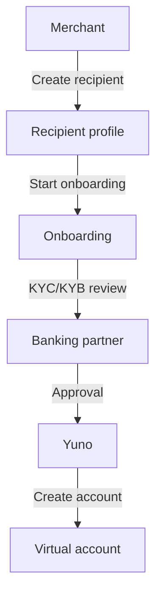
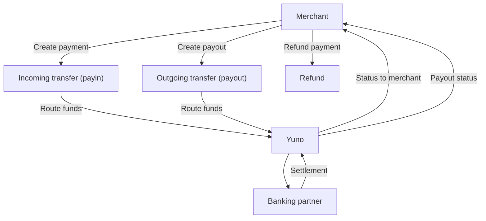
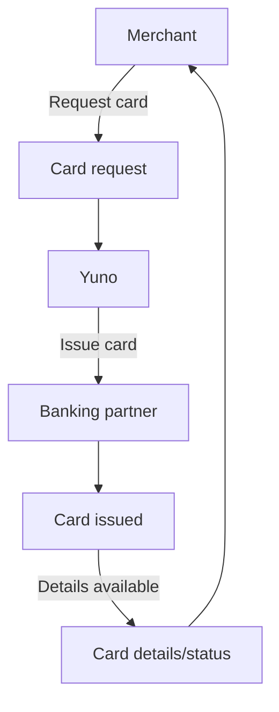

Embedded Banking, or **Banking as a Service (BaaS)**, is a model where licensed banks or virtual banks provide **banking infrastructure to partners**, including **virtual accounts**, **fund custody**, **transfers**, and **payment instruments (cards)**. This enables partners to embed regulated financial services directly into their products without holding a banking license themselves.

It is designed for companies that need to hold or move user balances under a banking license, such as **fintechs**, **exchanges**, **crypto wallets**, and **platforms that manage user funds**.

## Main functionalities

- Register or enroll a user (physical person) with KYC
- Register or enroll an entity (legal person) with KYB
- Create and manage virtual accounts with regulatory limits
- Manage transfers using local and international schemes (ACH, PIX, IBAN, SWIFT, Interac)
- Issue and manage physical or virtual cards under PCI DSS environments

## Other functionalities

- Bill payments
- Cash top-ups (eCash)
- High-yield savings accounts
- P2P transfers between users within the same institution

## Flow 1: Onboard user or entity and create account

This flow covers registering a user or entity, completing KYC/KYB, and creating a virtual account once onboarding is approved.

### Steps

1. **[Create a recipient](https://docs.y.uno/reference/create-recipient-1)** to register the user or entity profile
2. **[Start onboarding](https://docs.y.uno/reference/create-onboarding)** to initiate KYC/KYB and required validations
3. **[Continue onboarding](https://docs.y.uno/reference/continue-onboarding)** as documents or additional data are requested
4. **[Check onboarding status](https://docs.y.uno/reference/get-onboarding)** to monitor approval progress
5. **[Update recipient](http://docs.y.uno/reference/update-recipient-1)** if profile data changes during review
6. **Account creation** occurs after approval, resulting in a virtual account

### Account management

Status: `PENDING`

## Flow 2: Incoming and outgoing transfers

Transfers are split into **incoming transfers (payins)** and **outgoing transfers (payouts)**, depending on the direction of funds.

### Incoming transfer (payin)

1. **[Create payment](https://docs.y.uno/reference/create-payment)** to initiate the incoming transfer
2. **[Retrieve payment](https://docs.y.uno/reference/retrieve-payment-by-id)** to track status and confirm settlement
3. **[Refund payment](https://docs.y.uno/reference/refund-payment)** if the incoming transfer must be reversed

### Outgoing transfer (payout)

1. **[Create payout](https://docs.y.uno/reference/create-payout)** to send funds to a beneficiary
2. **[Retrieve payout](https://docs.y.uno/reference/retrieve-payout-by-id)** to track status and confirm completion

## Flow 3: Card management

This flow lets users request a physical or virtual card, view card details, and manage card status. Card operations must run under PCI DSS compliant environments and depend on the banking partner’s issuing capabilities.

Status: `PENDING`

## Interaction diagrams

### Onboard user or entity and create account

### Incoming and outgoing transfers

### Card management

## Glossary

| E-commerce | BaaS |
| --- | --- |
| Merchant | Partner |
| Customer | User / Entity |
| Payment | Incoming Transfer |
| Payout | Outgoing Transfer |
