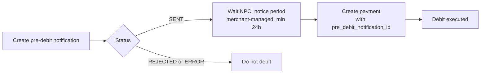

This guide covers Yuno's support for UPI Autopay recurring payments with Pre-Debit Notification (PDN).

UPI Autopay uses a customer-approved mandate, which is the customer's standing authorization for recurring debits. Once the mandate is in place, you initiate each recurring debit yourself through the API. Before every recurring debit, NPCI requires notifying the customer in advance. You trigger this Pre-Debit Notification (PDN) through the API, then reference it on the debit.

For background on customer-initiated transactions (**CIT**), merchant-initiated transactions (**MIT**), and usage values, see [Stored credentials](/docs/stored-credentials).

Autopay integrates with Yuno's existing payment flows through the `stored_credentials` field.

## How it works

* **First charge**: The initial payment is a customer-initiated transaction (CIT) processed directly with the payment provider to create the mandate and authorize future debits.
* **Pre-debit notifications**: For each recurring debit, trigger a PDN through [Create pre-debit notification](/reference/pre-debit-notifications/create-pre-debit-notification). The provider delivers it to the customer by SMS or email, then you reference the notification on the debit.
* **Messaging**: PDNs include the merchant name, amount, and scheduled date. Messages are localized (for example, English, Hindi, Tamil, Telugu, Bengali, Marathi). Email templates are white-labeled with merchant branding.
* **Retries**: Yuno does not automatically retry a failed UPI Autopay debit. If a debit fails, retrying is your responsibility. Create a new pre-debit notification and a new payment, within NPCI's cap of one attempt plus up to three retries.
* **Provider support**: Autopay with PDN is initially launching through Adyen and Billdesk.



## Pre-debit notifications

Every UPI Autopay recurring debit requires its own pre-debit notification. Trigger it yourself and reference it on the debit:

1. **Send the notification** with [Create pre-debit notification](/reference/pre-debit-notifications/create-pre-debit-notification), passing the mandate's `vaulted_token`, the upcoming `amount`, and the `billing_date`. Keep the returned `id` and confirm the status is `SENT`.

```json
{
  "account_id": "<ACCOUNT_ID>",
  "merchant_reference": "subscription-2026-08-INV-00187",
  "description": "Your subscription renews soon",
  "amount": { "currency": "INR", "value": "499.00" },
  "billing_date": "2026-08-01",
  "customer_payer": { "id": "<CUSTOMER_ID>" },
  "payment_method": { "type": "UPI_AUTOPAY", "vaulted_token": "<VAULTED_TOKEN>" },
  "origin_payment_id": "<MANDATE_PAYMENT_ID>"
}
```

2. **Wait at least 24 hours before the debit.** This is NPCI's minimum notice period. Yuno does not track or enforce elapsed time, so meeting this requirement is your responsibility.

3. **Create the recurring debit** with [Create payment](/reference/payments/create-payment), referencing the notification:

```json
{
  "amount": { "currency": "INR", "value": "499.00" },
  "customer_payer": { "id": "<CUSTOMER_ID>" },
  "payment_method": {
    "type": "UPI_AUTOPAY",
    "vaulted_token": "<VAULTED_TOKEN>",
    "detail": {
      "bank_transfer": {
        "pre_debit_notification_id": "<ID_FROM_STEP_1>"
      }
    }
  }
}
```

Yuno validates the referenced notification (it must exist, belong to your account, and be in `SENT` status) and forwards the provider's notification reference with the debit. If the validation fails, the payment is rejected with `PRE_DEBIT_NOTIFICATION_NOT_FOUND` or `PRE_DEBIT_NOTIFICATION_NOT_SENT` (HTTP 422) and no charge is attempted.

## Payment flows

NPCI sets an amount threshold that determines whether a recurring debit can run as a merchant-initiated transaction (MIT) or must be a customer-initiated payment (CIT) instead. You are responsible for applying this threshold in your own billing logic, since Yuno does not automate it.

* **Below threshold (≤ INR 50,000)**: You can debit the mandate as an MIT using the [pre-debit notification flow](#pre-debit-notifications) described above.
* **Above threshold (> INR 50,000)**: NPCI requires a customer-initiated payment. You must collect direct action from the customer instead of debiting the mandate.

## `stored_credentials` fields

Implement Autopay through the `stored_credentials` field available in endpoints like [Create payment](/reference/payments/create-payment). The full path for create payments is `payment_method.detail.bank_transfer.stored_credentials`.

Use `stored_credentials.usage` to mark whether this is the mandate-creating charge or a later debit against it, the same generic CIT/MIT marker used across other stored-credential payment methods:

| Field   | Value   | Behavior                                                                                          |
| ------- | ------- | -------------------------------------------------------------------------------------------------- |
| `usage` | `FIRST` | Run the direct charge (CIT) that creates the mandate and stores the reference for future debits.  |
| `usage` | `USED`  | Marks this as a subsequent debit (MIT) against the mandate. Does not, by itself, send a pre-debit notification. |

<Warning>
Setting `usage` does not trigger a pre-debit notification. Every UPI Autopay recurring debit needs its own pre-debit notification, created and referenced separately, as described above.
</Warning>

## Regulatory compliance

Yuno's UPI Autopay integration operates under National Payments Corporation of India (NPCI) requirements. Since the pre-debit notification flow is fully merchant-managed today, meeting each of these is your responsibility. Yuno validates only that a referenced notification exists and is in `SENT` status.

* **Advance notice window**: NPCI requires a minimum of 24 hours' notice before the debit.
* **Execution windows (IST)**: Debits must run only in approved time windows: before 10:00 AM, 1:00-5:00 PM, or after 9:30 PM.
* **MIT amount threshold**: MIT autopay is allowed up to INR 50,000. Any amount above that requires a customer-initiated payment (CIT).
* **Retry limits**: NPCI allows 1 execution attempt plus up to 3 retries. Yuno does not automate retries. If a debit fails, create a new pre-debit notification and a new payment for the retry attempt.

<br />