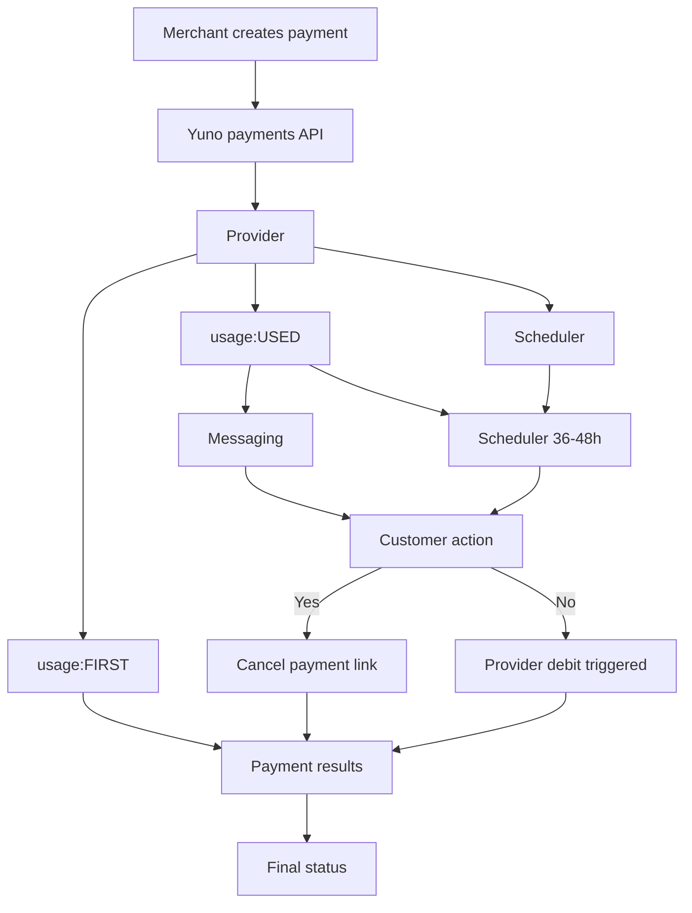

This guide covers Yuno's support for UPI Autopay recurring payments with Pre-Debit Notification (PDN).

UPI Autopay uses a customer-approved mandate, which is the customer's standing authorization for recurring debits. Once the mandate is in place, Yuno can initiate scheduled debits without requiring the customer to take action each time. Before every recurring debit, Yuno sends a Pre-Debit Notification (PDN) to the customer in advance. This notice period gives the customer time to review the upcoming charge and cancel if needed, and the debit is only executed if the customer does not opt out.

For background on customer-initiated transactions (**CIT**), merchant-initiated transactions (**MIT**), and usage values, see [Stored credentials](/docs/stored-credentials).

Autopay integrates seamlessly with Yuno's existing payment flows through the `stored_credentials` field.

## How it works

* **First charge**: The initial payment is a customer-initiated transaction (CIT) processed directly with the payment provider to create the mandate and authorize future debits.
* **PDNs**: For recurring debits, Yuno sends a pre-debit notification (PDN) that the customer receives by SMS or email, waits the required notice period, and then executes the debit automatically unless the customer cancels.
* **Messaging and opt-out**: PDNs include the merchant name, amount, and scheduled date, plus a cancellation link. Messages are localized (for example, English, Hindi, Tamil, Telugu, Bengali, Marathi). Email templates are white-labeled with merchant branding.
* **Webhook cancellation**: If the customer clicks the cancellation link, Yuno validates the transaction, cancels the scheduled debit, updates the payment status, and notifies the merchant.
* **Scheduling and retries**: Debits are scheduled to run after the notice period in approved IST windows. If a debit fails, Yuno schedules retries based on the configured schedule and retry limits.
* **Async status and webhooks**: Payment state updates run asynchronously and emit merchant events for PDN sent, cancellations, successes, retry scheduled, and final failure.
* **Provider support**: Autopay with PDN is initially launching through Adyen and Billdesk.



## Payment flows

Autopay uses amount thresholds to determine whether a charge can run as MIT or must be handled as a customer-initiated payment (CIT). This keeps recurring debits compliant and sets expectations for customer action.

* **Below threshold (≤ INR 50,000)**: Yuno sends the PDN to the customer, waits the 36-48 hour notice period, and then executes the MIT debit in an IST window. If the customer cancels during the notice period, the debit is not executed.
* **Above threshold (> INR 50,000)**: Yuno sends a CIT notification 72-48 hours in advance with a way for the customer to complete the payment. The customer must actively pay; if they do not, no MIT debit is executed.

## `stored_credentials` fields

Implement Autopay through the `stored_credentials` field available in endpoints like [Create payment](/reference/payments/create-payment). The full path for create payments is `payment_method.detail.bank_transfer.stored_credentials`.

Use `stored_credentials.usage` to declare the intent:

| Field   | Value   | Behavior                                                                       |
| ------- | ------- | ------------------------------------------------------------------------------ |
| `usage` | `FIRST` | Run the direct charge (CIT) and store the mandate reference for future debits. |
| `usage` | `USED`  | Send the PDN, wait the 24-hour notice period, then run the MIT debit.          |

## API-driven pre-debit notifications

If you manage your own billing schedule, trigger the pre-debit notification yourself and reference it on the debit. This is the flow available today through the API:

1. **Send the notification** with [Create pre-debit notification](/reference/pre-debit-notifications/create-pre-debit-notification), passing the mandate's `vaulted_token`, the upcoming `amount`, and the `billing_date`. Keep the returned `id` and confirm the status is `SENT`.

```json
{
  "account_id": "<ACCOUNT_ID>",
  "merchant_reference": "subscription-2026-08-INV-00187",
  "description": "Your subscription renews soon",
  "amount": { "currency": "INR", "value": "499.00" },
  "billing_date": "2026-08-01",
  "customer_payer": { "id": "<CUSTOMER_ID>" },
  "payment_method": { "type": "UPI_AUTOPAY", "vaulted_token": "<VAULTED_TOKEN>" },
  "origin_payment_id": "<MANDATE_PAYMENT_ID>"
}
```

2. **Wait the NPCI notice period** (at least 24 hours before the debit).

3. **Create the recurring debit** with [Create payment](/reference/payments/create-payment), referencing the notification:

```json
{
  "amount": { "currency": "INR", "value": "499.00" },
  "customer_payer": { "id": "<CUSTOMER_ID>" },
  "payment_method": {
    "type": "UPI_AUTOPAY",
    "vaulted_token": "<VAULTED_TOKEN>",
    "detail": {
      "bank_transfer": {
        "pre_debit_notification_id": "<ID_FROM_STEP_1>"
      }
    }
  }
}
```

Yuno validates the referenced notification (it must exist, belong to your account, and be in `SENT` status) and forwards the provider's notification reference with the debit. If the validation fails, the payment is rejected with `PRE_DEBIT_NOTIFICATION_NOT_FOUND` or `PRE_DEBIT_NOTIFICATION_NOT_SENT` (HTTP 422) and no charge is attempted.

## Dunning and retries

If an MIT debit fails, Yuno retries instead of marking the payment as final failure immediately. The retry schedule is configurable per account.

| Attempt    | Message                                                                     |
| ---------- | --------------------------------------------------------------------------- |
| 1st fail   | "Payment failed. We'll retry tomorrow. No action needed."                   |
| 2nd fail   | "Payment still pending. Retry in 2 days (`link to update payment method`)." |
| 3rd fail   | "Final retry scheduled for `date`. Please ensure funds are available."      |
| Final fail | "Payment could not be processed. Contact `merchant` to resolve."            |

## Regulatory compliance

Yuno follows the National Payments Corporation of India (NPCI) requirements for UPI Autopay.

* **Advance notice window**: PDNs must be sent 36-48 hours before the debit. NPCI allows a minimum of 24 hours.
* **Customer opt-out**: The PDN includes a webhook link delivered via SMS or email. If the customer cancels before the scheduled debit, Yuno stops the charge.
* **Execution windows (IST)**: Debits are executed only in approved time windows: before 10:00 AM, 1:00-5:00 PM, or after 9:30 PM.
* **MIT amount threshold**: MIT autopay is allowed up to INR 50,000. Any amount above that requires a customer-initiated payment (CIT).
* **Retry limits**: NPCI allows 1 execution attempt plus up to 3 retries.

<br />