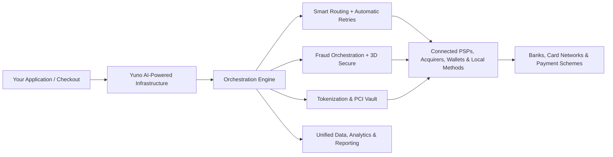

<Info>
  **Pro-tip for developers**: You can connect your AI agent (Cursor, Windsurf, Claude) directly to these docs for real-time assistance. [Set up MCP](/setup-mcp).
</Info>

**Yuno is the intelligent payments infrastructure for modern businesses.**

Yuno is not just a payment orchestration platform. It is a full-stack, **AI-powered payments infrastructure** that lets you connect, optimize, secure, and operate your entire payment ecosystem through a single integration.

Instead of building and maintaining multiple integrations with different payment service providers (PSPs), acquirers, fraud tools, and local payment methods, you integrate with Yuno **once**. From there, Yuno intelligently orchestrates routing, fraud prevention, tokenization, retries, and operations across all connected providers using real-time intelligence and configurable automation.

Yuno acts as the intelligent control plane between your application and the global payments ecosystem.

## The problem with traditional payment setups

Most companies still manage payments in a fragmented way:

* Multiple direct integrations that are expensive to build and maintain
* Siloed data with limited visibility across providers
* Suboptimal approval rates because each provider operates in isolation
* Manual or disconnected fraud management
* Slow and costly expansion into new markets or payment methods
* High technical debt and PCI compliance burden

This approach becomes unsustainable as soon as a business needs better performance, global reach, or operational efficiency.

## How Yuno solves it

Yuno replaces fragmented point-to-point connections with a **unified, intelligent infrastructure layer**.

You connect once to Yuno. Yuno then handles communication, intelligent decision-making, and orchestration with all your payment providers, fraud tools, and local methods.

### High-level architecture

Your application only communicates with Yuno. Yuno intelligently manages everything else.

## Core capabilities

| Capability                 | Description                                                                                    | Business impact                                              |
| -------------------------- | ---------------------------------------------------------------------------------------------- | ------------------------------------------------------------ |
| Single integration         | One API and set of SDKs to access all payment methods and providers                            | Dramatically reduced development and maintenance effort      |
| AI-powered smart routing   | Routes each transaction to the optimal provider in real time, with automatic retries           | Higher approval rates and lower processing costs             |
| Fraud orchestration        | Combine multiple fraud tools and 3D Secure under unified, rule-based control                   | Better protection with minimal customer friction             |
| Tokenization and vault     | PCI-compliant tokenization with support for network tokens                                     | Reduced PCI scope and improved authorization rates           |
| No-code configuration      | Enable or disable methods, set routing rules, and manage workflows from the dashboard          | Business teams can move fast without engineering             |
| Unified data and operations| Normalized view of all transactions, refunds, disputes, and performance                        | Full visibility and faster reconciliation                    |
| Payouts and disputes       | Manage payouts, refunds, and chargebacks across all providers from one place                   | Operational efficiency and reduced complexity                |
| Checkout SDKs              | Web, iOS, Android, Flutter, and React Native SDKs                                              | Fast, customizable, and high-converting checkout experiences |

## Why Yuno matters

| Outcome              | Traditional multi-provider setup            | With Yuno                                                    |
| -------------------- | ------------------------------------------- | ------------------------------------------------------------ |
| Approval rates       | Limited by individual provider performance  | Optimized across providers with intelligent retries          |
| Time to market       | Weeks or months per new method or provider  | Mostly configuration instead of development                  |
| Engineering effort   | High and continuously growing               | One integration with minimal ongoing maintenance             |
| Global expansion     | Expensive and slow                          | Add new markets and payment methods with little effort       |
| Visibility & control | Fragmented across providers                 | Single source of truth with unified data                     |
| Future readiness     | Difficult to evolve                         | Built to continuously improve with intelligent automation    |

**Key outcomes:**

* Higher conversion rates
* Lower operational costs
* Faster scaling
* Reduced technical debt
* Greater business agility

## Who Yuno is built for

Yuno is ideal for:

* Companies expanding globally, especially in high-growth markets
* Businesses with meaningful transaction volume that want performance optimization
* Teams that need both powerful developer tools and strong no-code capabilities
* Organizations looking to reduce technical complexity while increasing control and visibility

## Integration options

Yuno offers flexible integration paths depending on your needs:

* **SDK integration (recommended)** — Use Yuno's Web, iOS, Android, Flutter, or React Native SDKs for secure and customizable checkout experiences.
* **Direct API** — Server-to-server integration when you need maximum control over the payment flow.
* **Payment Links** — Create hosted payment experiences via URL with minimal development work.

## Next steps

| Step | Action                                       | Link                                                                          |
| ---- | -------------------------------------------- | ----------------------------------------------------------------------------- |
| 1    | Understand how payments flow through Yuno    | [How the Yuno payment process works](/docs/how-yuno-works/how-yuno-payment-flow-works) |
| 2    | Set up your account and connect providers    | [Set up your account](/docs/step-1-set-up-your-account)                       |
| 3    | Choose your integration method               | [Choose an integration](/docs/sdks/overview/choose-integration)               |
| 4    | Create your first payment                    | [Create your first payment](/docs/step-2-your-first-payment)                  |
| 5    | Learn the core concepts                      | [Basic concepts](/docs/basic-concepts)                                        |
