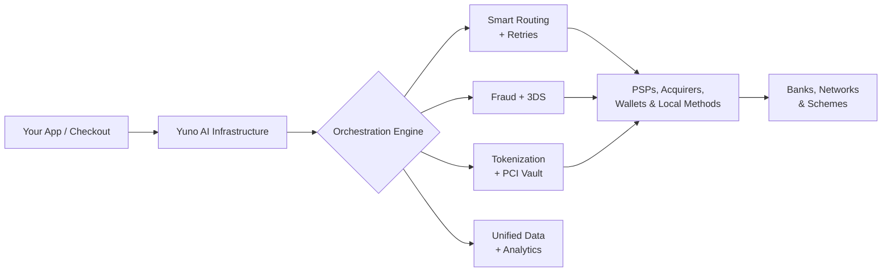

<Info>
  **Pro-tip for developers**: Connect your AI agent (Cursor, Windsurf, Claude) directly to these docs. [Set up MCP](/setup-mcp).
</Info>

Yuno is a full-stack, **AI-powered payments infrastructure**. Integrate **once** to connect, optimize, secure, and operate every PSP, acquirer, fraud tool, and local payment method.

Yuno is the intelligent control plane between your app and the global payments ecosystem.

## Traditional payments are broken

<CardGroup cols={3}>
  <Card title="Fragmented" icon="puzzle-piece">
    Multiple direct integrations, expensive to build and maintain.
  </Card>
  <Card title="Blind" icon="eye-slash">
    Siloed data with limited visibility across providers.
  </Card>
  <Card title="Underperforming" icon="chart-line-down">
    Approval rates capped by isolated providers.
  </Card>
  <Card title="Risky" icon="shield-halved">
    Manual, disconnected fraud management.
  </Card>
  <Card title="Slow" icon="hourglass-half">
    Expansion into new markets takes weeks or months.
  </Card>
  <Card title="Heavy" icon="weight-hanging">
    High technical debt and PCI compliance burden.
  </Card>
</CardGroup>

## How Yuno solves it

You connect once. Yuno orchestrates everything else — routing, fraud, tokenization, retries, and operations — in real time.

## Core capabilities

<CardGroup cols={2}>
  <Card title="Single integration" icon="plug">
    One API and SDK set for every provider and method.
  </Card>
  <Card title="AI smart routing" icon="brain-circuit">
    Optimal provider per transaction, in real time, with automatic retries.
  </Card>
  <Card title="Fraud orchestration" icon="shield-check">
    Multiple fraud tools and 3DS under one rule engine.
  </Card>
  <Card title="Tokenization & vault" icon="lock">
    PCI-compliant vault with network token support.
  </Card>
  <Card title="No-code workflows" icon="wand-magic-sparkles">
    Toggle methods and routing rules from the dashboard.
  </Card>
  <Card title="Unified data" icon="database">
    Normalized transactions, refunds, disputes, and performance.
  </Card>
  <Card title="Payouts & disputes" icon="money-bill-transfer">
    Payouts, refunds, and chargebacks across all providers.
  </Card>
  <Card title="Checkout SDKs" icon="mobile-screen">
    Web, iOS, Android, Flutter, and React Native.
  </Card>
</CardGroup>

## Traditional vs. Yuno

| Outcome              | Traditional setup           | With Yuno                                |
| -------------------- | --------------------------- | ---------------------------------------- |
| **Approval rates**   | Capped per provider         | Optimized across providers + retries     |
| **Time to market**   | Weeks or months             | Configuration, not development           |
| **Engineering**      | Constantly growing          | One integration, minimal maintenance     |
| **Global expansion** | Expensive and slow          | Add markets and methods in clicks        |
| **Visibility**       | Fragmented                  | Single source of truth                   |
| **Future readiness** | Hard to evolve              | Continuously improving automation        |

## Business impact

<CardGroup cols={3}>
  <Card title="Higher conversion" icon="arrow-trend-up" />
  <Card title="Lower op costs" icon="arrow-trend-down" />
  <Card title="Faster scaling" icon="rocket" />
  <Card title="Less tech debt" icon="broom" />
  <Card title="More agility" icon="bolt" />
  <Card title="Full control" icon="sliders" />
</CardGroup>

## Who Yuno is built for

<AccordionGroup>
  <Accordion title="Global-expansion companies" icon="globe">
    Especially teams growing into high-growth markets with complex local methods.
  </Accordion>
  <Accordion title="High-volume merchants" icon="chart-column">
    Businesses where a few points of approval rate move real revenue.
  </Accordion>
  <Accordion title="Product + business teams" icon="users">
    Teams that want strong developer tools *and* real no-code control.
  </Accordion>
  <Accordion title="Teams cutting complexity" icon="scissors">
    Orgs replacing tangled point-to-point integrations with one control plane.
  </Accordion>
</AccordionGroup>

## Integration options

<CardGroup cols={3}>
  <Card title="SDKs" icon="code" href="/docs/sdks/overview/choose-integration">
    **Recommended.** Web, iOS, Android, Flutter, React Native.
  </Card>
  <Card title="Direct API" icon="server">
    Server-to-server for maximum control.
  </Card>
  <Card title="Payment Links" icon="link">
    Hosted checkout via URL, minimal dev work.
  </Card>
</CardGroup>

## Next steps

<Steps>
  <Step title="See the payment flow">
    [How the Yuno payment process works](/docs/how-yuno-works/how-yuno-payment-flow-works)
  </Step>
  <Step title="Set up your account">
    [Connect your first providers](/docs/step-1-set-up-your-account)
  </Step>
  <Step title="Choose an integration">
    [Pick SDK, API, or Payment Links](/docs/sdks/overview/choose-integration)
  </Step>
  <Step title="Create your first payment">
    [Run an end-to-end transaction](/docs/step-2-your-first-payment)
  </Step>
  <Step title="Learn the core concepts">
    [Basic concepts](/docs/basic-concepts)
  </Step>
</Steps>
