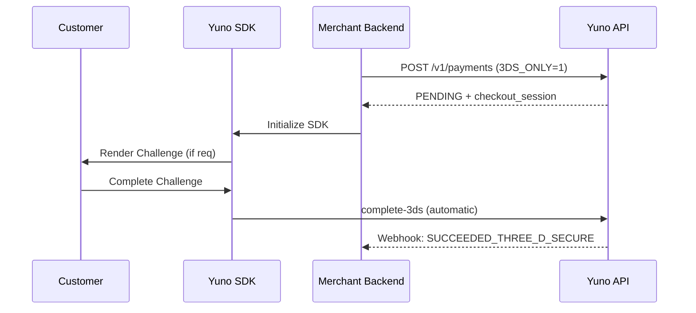
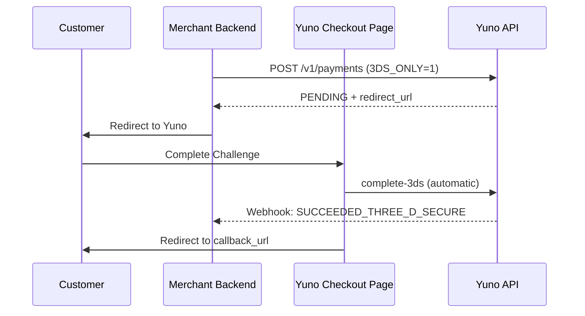

3DS Standalone decouples 3DS authentication from payment authorization, allowing you to run 3DS as an independent step and decide **after** authentication whether to proceed with payment.

## Overview

This feature is ideal for merchants who need to evaluate the 3DS result through internal fraud or risk engines before making an authorization decision. You use Yuno only for authentication and then route the payment through your own PSP or back through Yuno separately.

<Note>
**Key Principle:** This flow reuses the existing 3DS V2 infrastructure. No new endpoints are required. The logic is triggered via metadata.
</Note>

## Quick Summary

| Question | Answer |
| :--- | :--- |
| **What does it do?** | Runs 3DS authentication only — no payment charge. |
| **How to trigger it?** | Send `"metadata": [{"key": "3DS_ONLY", "value": "1"}]` in the payment request. |
| **What do I receive?** | A webhook with the ECI, CAVV (cryptogram), and authentication status. |
| **Can I pay through Yuno later?** | Yes. Send a separate payment request with the ECI and CAVV. |
| **Who supports it?** | Checkout.com (`CHECKOUT_3DS`) and Netcetera (`NETCETERA_3DS`). |

## Integration Options

Choose the integration method that best fits your PCI compliance level and desired user experience.

| | SDK Flow (Checkout) | Direct Flow (Redirect) |
| :--- | :--- | :--- |
| **PCI required?** | No — Yuno SDK handles card data | Yes — You send raw card numbers |
| **SDK needed?** | Yes — Yuno SDK (Web/iOS/Android) | No — Yuno provides a redirect URL |
| **Challenge handling** | SDK renders challenge automatically (iframe) | Redirect customer to Yuno URL |
| **Best for** | Merchants wanting Yuno to handle the full UX | PCI-compliant merchants wanting full control |

---

## Flow 1 — SDK Integration (Checkout)

The Yuno SDK handles device fingerprinting, challenge rendering, and completing the 3DS process automatically.

### 1. Create Payment Request

Include the `3DS_ONLY=1` metadata in your `POST /v1/payments` request.

```json
{
  "amount": {
    "currency": "BRL",
    "value": 15000
  },
  "payment_method": {
    "type": "CARD",
    "card": {
      "number": "4456...",
      "holder_name": "JOHN DOE",
      "expiration_month": 8,
      "expiration_year": 2030,
      "security_code": "123"
    }
  },
  "metadata": [
    {
      "key": "3DS_ONLY",
      "value": "1"
    }
  ]
}
```

### 2. Initialize the SDK

Use the `checkout.session` returned in the response to initialize the Yuno SDK. The SDK will handle the 3DS challenge if required.

```javascript
const yuno = Yuno.initialize({
  checkoutSession: "cs_xxxxxxxx",
  publicApiKey: "YOUR_PUBLIC_KEY",
});

yuno.startCheckout({
  elementSelector: "#yuno-payment-form",
  onResult: (result) => {
    console.log("3DS Authentication complete", result);
  }
});
```

---

## Flow 2 — Direct Integration (Redirect)

For PCI-compliant merchants. Yuno provides a redirect URL where the customer completes the 3DS challenge.

### 1. Create Payment Request

Follow the same steps as the SDK flow, but send raw card data if you are PCI-compliant. Yuno will return a `redirect_url`.

### 2. Redirect the Customer

Redirect the customer's browser to the `redirect_url`. Yuno will handle the challenge and redirect the customer back to your `callback_url` once complete.

```javascript
window.location.href = redirect_url;
```

---

## Flow Diagrams

### SDK Flow



### Direct Flow



---

## Webhook Notifications

Once authentication is complete, Yuno sends a `SUCCEEDED_THREE_D_SECURE` event to your callback URL.

```json
{
  "event_type": "SUCCEEDED_THREE_D_SECURE",
  "data": {
    "status": "APPROVED",
    "sub_status": "THREE_D_SECURE_AUTHENTICATED",
    "transactions": [
      {
        "type": "THREE_D_SECURE",
        "three_d_secure": {
          "electronic_commerce_indicator": "05",
          "cryptogram": "AAABBJg0VhI0VniQEjRWAAAAAAA=",
          "transaction_id": "f25084f0-5b16-4c0a-ae5d-b24808571045",
          "authentication_status": "Y",
          "liability_shift": true
        }
      }
    ]
  }
}
```

## Interpreting the Result

Use the following reference to decide whether to proceed with authorization.

| authentication_status | liability_shift | Recommended Action |
| :--- | :--- | :--- |
| `Y` | `true` | **Authorize**: Fully authenticated. |
| `A` | `true` | **Authorize**: Attempted; liability still shifts. |
| `N` | `false` | **Do not authorize**: Authentication failed. |
| `U` | `false` | **Risk evaluation**: Authentication unavailable. |

---

## Authorizing the Payment

After receiving the 3DS data, you have two options:

### Option A: Authorize through Yuno

Send a new `POST /v1/payments` request (without the `3DS_ONLY` metadata) and include the `three_d_secure` data received in the webhook.

```json
{
  "payment_method": {
    "type": "CARD",
    "card": {
      "number": "4456...",
      ...
      "three_d_secure": {
        "eci": "05",
        "cryptogram": "AAABB...",
        "transaction_id": "f2508...",
        "version": "2.2.0"
      }
    }
  }
}
```

### Option B: Authorize through your own PSP

Pass the ECI, CAVV, and Transaction ID directly to your processor according to their API requirements.

---

## Dashboard Configuration

### 1. Create a 3DS Connection
In the **Dashboard**, go to **Connections** and add a **Yuno 3DS** connection. Ensure the **Yuno 3DS Standalone** checkbox is enabled and provide the required acquirer data (BIN, MID, MCC, etc.).

### 2. Configure Routing
Set up a **CARD route** with a condition:
- **IF** metadata `3DS_ONLY` equals `1`
- **THEN** route to your **Yuno 3DS Standalone** connection.

<Frame>

</Frame>
