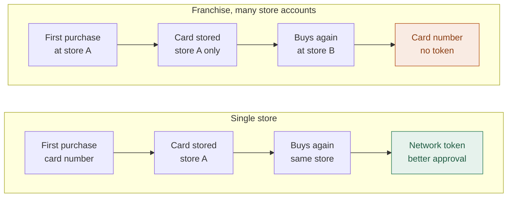

## Multi-affiliation

A single VTEX account can be connected to **more than one Yuno integration** when you need to process different payment methods through different Yuno accounts. For example, you can assign one Yuno account to credit cards and a different one to wallets.

To set this up, repeat Step 1 once per integration, giving each one a distinct **Affiliation Name**. Then, when activating payment methods, use the **Process with affiliation** field to choose which account should process it.

## Multi-account

If your business runs **multiple VTEX accounts** — a franchise model, a marketplace with affiliates, or separate storefronts sharing a checkout — the Yuno plugin needs to know which account owns the orders. The **Main Account** fields in the provider configuration tell it where to look. The rule that applies to every row below: *Main Account Name is the account whose OMS owns the order.* It is not necessarily the account where the Payment App runs or the account that creates the payment.

### When you need the fields

| Your setup | Main Account fields |
| :--- | :--- |
| **Single account** — one store, one admin | Not required. Leave all three fields empty. |
| **Franchise fan-in** — many store accounts (franchisees) under a parent account that owns the catalog and orders | Required on **every franchise affiliation**. Set Main Account Name to the parent account. |
| **Marketplace affiliate** — a storefront whose orders are paid through a different account's checkout, where the sellers process the payment | Required on the **seller account's** affiliation (the account that authorizes and processes the payment). Main Account Name is the marketplace account, which owns the order. This must be a **dedicated affiliation for the marketplace trade policy**, not the seller's regular storefront affiliation — single-order lookup, lookup-by-payment-id and order cancellation always target the main account. Sharing the fields on a regular affiliation breaks the seller's own storefront traffic. |
| **1-to-1 satellite** — two accounts where one authorizes and the other completes the payment (for example, a B2B storefront with a separate payment account) | Required on the authorizing account's affiliation. Main Account Name is the account whose OMS owns the order. |

### What each field does

**Main Account Name:** the VTEX account that owns the order data in OMS. The plugin reads orders, order groups, and seller data from this account, and sends the Yuno credentials to it so that fulfillment events are emitted from the correct OMS. Trade-policy resolution uses the current account's credentials.

**Main Account App key** and **Main Account App token:** application credentials of that main account. The plugin uses them to call VTEX APIs on behalf of the main account.

<Warning>
  **All three fields must be set together.** If you set the Main Account Name but leave the App key or App token empty, the plugin treats the affiliation as if no Main Account fields were configured — it reads catalog and order data from the current account, just like a single-account setup. A value of `NA` (a legacy convention on some affiliations) is also treated as empty. The three fields are either all active or all absent; there is no intermediate state.
</Warning>

### How to obtain the main account credentials

In the main account's **VTEX License Manager**, create an application key. The key is used for these API calls on the main account:

*   **OMS**: read orders, order groups, and seller data; cancel denied orders (`POST /api/oms/pvt/orders/{id}/cancel`).
*   **Catalog**: read product and SKU information.
*   **Subscriptions**: read subscription cycles (`GET /api/rns/pub/cycles`), for stores that use VTEX Subscriptions.

The key must be created in the main account, not in the franchise or satellite account. A key created in the wrong account cannot read the data the plugin needs. For details on creating keys and assigning permissions, see [VTEX License Manager](https://help.vtex.com/en/tutorial/license-manager-resources--3q6ztrC8YynQf6rdc6euk3).

### Symptoms of a misconfigured Multi-account

When the Main Account fields are **missing or point to the wrong account**, the failure can be silent — no error appears in the VTEX dashboard or at checkout. Wrong credentials or a wrong account name, however, produce visible API errors in the plugin logs (401, 403, or 404 responses on OMS calls).

| Symptom | What is happening |
| :--- | :--- |
| Orders never marked as fulfilled | The Yuno credentials were stored in a different account than the one that emits the order status events, so the event handler finds nothing and stops. |
| Fulfillment works but authorization retries or order cancellations fail after payment | The main-account credentials are invalid or the account name does not match. Check for VTEX API errors on OMS calls in the plugin logs. |
| Trade policy or sales channel name sent to Yuno is wrong | The trade policy is resolved with the current account's credentials, but the order data is read from the main account. A mismatch between the two produces wrong routing and reporting data on the Yuno side. |
| Split orders not detected | The plugin queries the wrong OMS for related sub-orders. An antifraud session is not shared; each sub-order gets its own. |
| Payment rejected or created without store data (empty sales channel or seller website) | The order does not exist in the account the plugin queried at authorization time. Check the payment's additional data in the Yuno dashboard. |

### How to verify the setup

**For the merchant:**

Place a test order on the store, then check the Yuno dashboard:

*   The payment carries the expected **sales channel** in its additional data.
*   A **fulfillment update** appears once the order ships in VTEX (this confirms the credentials landed in the account whose OMS emits the status events).

<Accordion title="Verifying the setup (for Yuno TAMs)">
  From the VTEC Admin, get the `application_session` of the test order, then look up the plugin audit logs in Datadog (`service:sdk-event-log-audit-ms`):

  1.  Confirm that `organization_name` in the authorization steps matches the **origin account** (the franchise or satellite), and that the `saveYunoKeys` hop targets the main account.
  2.  If `saveYunoKeys` targets the origin account itself, or a different account from the expected main one, the Main Account fields are misconfigured — check that all three fields are populated and that the Main Account Name matches the account you intend.
  3.  Confirm that no `sendFulfillment` log appears for an order that did ship — its absence means the credentials landed in the wrong account and the fulfillment event handler found nothing.
</Accordion>

<Note>
  Features that depend on per-account state — card vault for network tokens, order modifications, and corporate buyer data — must be enabled on **every** franchise affiliation individually. Enabling them on the parent account alone is not enough, because the plugin reads these settings from the affiliation that authorizes each order. See [Network tokens](#network-tokens-repeat-card-purchases), [Order modifications](#order-modifications-changed-order-totals), and [Corporate purchases](#corporate-purchases-brazil) for per-feature setup instructions.
</Note>

## Split orders (multiple sellers)

When a shopper's cart contains products from **different sellers or franchises**, VTEX splits the purchase into multiple suborders and authorizes each one independently. The Yuno integration detects this and processes **every** suborder, so the entire order is paid, not just the first part. A single antifraud session is shared across all of them.

This works automatically; no extra setup is required. If you want to control which antifraud providers receive the shared session, use the **Antifraud Providers for Split Orders** field in the provider configuration (see the field reference in Step 1). Valid values are `RISKIFIED`, `CYBERSOURCE`, `SIGNIFYD`, and `CIELO_CYBERSOURCE_FRAUD`; when left empty, it defaults to `RISKIFIED` + `CYBERSOURCE`.

## Antifraud session (device fingerprints)

Antifraud providers (Riskified, Signifyd, CyberSource, Cielo CyberSource) score a payment by matching the device data collected in the shopper's browser with the session id Yuno sends in the payment. For that match to work, the browser and the server must use the **same** session id.

The Yuno Payment App handles this for you: on the checkout page it reads the VTEX cart id (`window.vtexjs.checkout.orderFormId`) and reports it as the antifraud session id for `RISKIFIED`, `SIGNIFYD`, `CYBERSOURCE`, and `CIELO_CYBERSOURCE_FRAUD`. The Yuno Payment Connector sends the same `orderFormId` on the server side, so the session is consistent across the browser, every suborder of a split order, and the payment itself. No configuration is needed; if the cart id is not available, each provider falls back to its own generated session id and the payment is not blocked.

<Accordion title="Cielo CyberSource: merchant ID prefix">
  Cielo CyberSource requires the antifraud session id to start with your Cielo merchant ID (MID) prefix. Until this prefix is configurable in the Yuno dashboard, set it in your VTEX checkout custom JavaScript **before** the checkout loads:

  ```javascript
  window.yunoFingerprintPrefix = 'YOUR_MID_PREFIX_'
  ```

  The Payment App prepends it only to the `CIELO_CYBERSOURCE_FRAUD` session id (`YOUR_MID_PREFIX_<orderFormId>`); the other providers are not affected. When the variable is not defined, no prefix is applied.

  <Note>
    This global variable is an interim mechanism. Once the fingerprint prefix can be configured in the Yuno dashboard, it will no longer be needed.
  </Note>
</Accordion>

If you integrate the SDK directly instead of using the Payment App, pass the session ids yourself through the `deviceFingerprints` mount option. See [Direct SDK integration](/docs/plugins/vtex/direct-sdk-integration).

## Order modifications (changed order totals)

VTEX lets you **change an order after checkout**, when the final total turns out to be different from the amount that was authorized. This applies, for example, if you sell products **by weight**, where the exact total is only known once the order is picked and packed.

*   If the final total is the **same or lower**, VTEX captures only the final amount. No extra setup is required.
*   If the final total is **higher**, VTEX charges the difference as a **separate, automatic charge**. Since the shopper is no longer present and does not re-enter their card, Yuno charges the difference against the card they already used on the original order.

To enable automatic charges when an order total **increases**, configure the following in your provider settings **before** the orders you expect to modify are placed:

| Field | Value |
| :--- | :--- |
| **Vault Card for Order Modification** | **Yes**: stores the card on the original order so it can be charged again for the difference. |
| **Create Customer** | **Yes**: required, so the card is stored against a Yuno customer. Both fields must be enabled together. |
| **Automatic Settlement** | **Disabled** (recommended). The original payment is authorized at checkout and captured at invoicing. If the final total is **lower** than the authorized amount, only that lower amount is captured (a partial capture). If it is higher, the difference is charged as a separate additional charge. |

<Note>
  Order-total **increases** are supported for **credit cards only** (a VTEX restriction). The card is stored at the time of the original payment, so **Vault Card for Order Modification** and **Create Customer** must be enabled **before** the order is placed. Turning them on later does not apply to orders that already exist.
</Note>

<Note>
  **Franchises / multiple accounts:** enable **Vault Card for Order Modification** and **Create Customer** on **every** affiliation you use (each franchise or sub-account), and set the **Main Account** fields as described under [Multi-account](#multi-account).
</Note>

## Network tokens (repeat card purchases)

[Network tokens](/docs/security-and-compliance/network-tokens) replace the card number with a token issued by the card network (Visa, Mastercard, American Express). Paying with a network token instead of the card number improves approval rates for returning shoppers and keeps working when the card is reissued, because the network updates the token automatically.

Yuno can only attach a network token to a card it has securely stored. When **Enable Network Tokens** is on, the plugin stores each card the first time a customer pays with it and reuses that stored reference on every later purchase of the same card by the same customer. No storefront or Payment App change is needed; everything happens on the Yuno side of the integration.

### What has to be switched on

| Requirement | Where |
| :--- | :--- |
| **Enable Network Tokens** | Provider configuration in VTEX (Step 1), set to **Yes**. Has no effect on its own. |
| **Create Customer** | Same place, set to **Yes**. The stored card is bound to a Yuno customer, so both fields are required together. |
| **Plugin 4.2.347+** | Every VTEX account that runs the plugin, including the account that authorizes rather than pays (see [Multiple accounts](#multiple-accounts-and-franchises)). |
| **Route activation** | Done by Yuno on the routes your store uses. Not something you can set yourself: contact your Yuno KAM or [support](/docs/security-and-compliance/network-tokens#1-let-yuno-provision-and-collect-network-tokens). Activation is per route, and routes belong to a Yuno Account ID, so each account you process with needs its own activation. |

<Warning>
  **Both sides are required.** Until Yuno activates network tokens on your routes, the plugin stores cards but every payment is still processed with the card number and no network token is issued. The reverse also holds: if network tokens are active on your routes but **Enable Network Tokens** and **Create Customer** are not set in VTEX, no card is stored and every payment remains a regular card-number transaction. Confirm the activation with your KAM or support before expecting any change in approval rates.
</Warning>

### Enable it

In your provider configuration (Step 1), set the following two fields and save:

| Field | Value |
| :--- | :--- |
| **Create Customer** | **Yes**: required, because the stored card is bound to a Yuno customer. Both fields must be enabled together; **Enable Network Tokens** has no effect on its own. |
| **Enable Network Tokens** | **Yes**. Has no effect until Yuno activates network tokens on your routes (see above). |

<Frame>
  
</Frame>

### What to expect

*   **First purchase with a card**: processed with the card number, as today. The card is stored at the end of that purchase.
*   **Later purchases of the same card by the same customer**: processed with the network token.
*   **Gradual ramp-up**: because every card's first purchase still uses the card number, you will see almost no network tokens on day one. The benefit builds up as customers return with a card they have already used on your store.
*   **Reissued cards** (for example, a new expiration date after a renewal) keep being recognized, so the network token continues to be used.
*   **Fallback**: if the stored reference is not available for any reason, the payment proceeds with the card number exactly as it does today. Enabling this feature never causes a payment to fail.
*   **VTEX subscriptions** are not affected. Recurring charges have their own stored-credential flow, which keeps working as described in the [FAQs](/docs/plugins/vtex/faqs).
*   Applies to all card payments processed through the plugin, including fraud-defense payments and [split orders](#split-orders-multiple-sellers).

<Note>
  **Order modifications are not affected.** Storing a card for network tokens does not by itself allow the plugin to charge it again. [Additional charges when an order total increases](#order-modifications-changed-order-totals) remain controlled only by **Vault Card for Order Modification**: with that field set to **No**, an order-total increase is declined even though the card is stored.
</Note>



Store B has no record of the card, so it is treated as a first purchase. The payment still succeeds; it falls back to the card number.

### Multiple accounts and franchises

The card is stored in the VTEX account that **authorizes** the payment and is scoped to that account's Yuno **Account ID**. Keep this in mind in the following setups:

*   **Authorization and payment in different VTEX accounts** (for example, a B2B storefront that completes the payment in a second account): enable both fields on the affiliation of the account that **authorizes** the order, not only on the account that completes the payment. Both accounts must run plugin version **4.2.347 or later**.
*   **Franchises / multiple store accounts** (many store accounts sharing a main account): enable both fields on **every** franchise affiliation. A card stored by one store account is not shared with another, and a card stored under one Yuno Account ID is not visible to another, so each store builds its own card history. **The benefit therefore accrues per store**: a chain whose customers buy across several stores gets materially fewer tokenized payments than a single-store merchant, because each store only recognizes the cards first used in that same store. Route activation is also per Yuno Account ID, so Yuno must activate network tokens on the routes of **every** franchise account, not only the main one.

<Accordion title="Verifying the setup (for Yuno TAMs)">
  Place two orders with the same card and the same customer on the store, then look up the plugin logs for each order in Datadog and filter by the `step_function` attribute:

  | Order | Expected step functions |
  | :--- | :--- |
  | First purchase | `cardVaultLookup` reporting no stored card, followed by `cardVaultWrite` once the payment is created (the card is stored). |
  | Repeat purchase | `cardVaultLookup` reporting a match, followed by `cardVaultTokenPassed` (the stored reference was sent with the payment). |

  A repeat purchase that shows `cardVaultLookup` without a match usually means the two orders did not share the same Yuno customer (check **Create Customer**), were placed from different store accounts, or used a different card. If the stored reference is passed but the payment still shows a card number on the Yuno side, network tokens are not yet enabled on the route.
</Accordion>

## Corporate purchases (Brazil)

In Brazil, purchases made on behalf of a company must be paid and invoiced against the company's **CNPJ**, not the personal CPF of the person placing the order. When a shopper checks out as a company (*pessoa jurídica*), VTEX sends both identities to the plugin: the shopper's name and CPF, and the company's legal name (*razão social*), trade name (*nome fantasia*) and CNPJ.

By default the plugin uses the shopper's personal identity. With **Use Corporate Buyer Data** set to **Yes**, corporate orders are paid under the company instead: the boleto is issued to the CNPJ, and every other payment method (cards, PIX, wallets) carries the company as the payer in Yuno.

### Enable it

In your provider configuration (Step 1), set **Use Corporate Buyer Data** to **Yes** and save. No storefront or Payment App change is needed.

| Field | Value |
| :--- | :--- |
| **Use Corporate Buyer Data** | **Yes**. Requires plugin **4.2.350 or later**; the field only appears in the provider configuration once the store runs that version. |

### What to expect

| Order | Payer sent to Yuno |
| :--- | :--- |
| Shopper checks out as a company, Brazilian billing address | Company legal name, trade name and CNPJ (document type `CNPJ`). |
| Shopper checks out as an individual | Shopper's name and CPF, exactly as today. |
| Corporate checkout with a billing address outside Brazil | Shopper's personal identity. The corporate mapping is limited to Brazil, where the document type is known to be a CNPJ. |

*   **Same shopper, different roles.** A shopper can place one order as a company and the next as an individual; each order carries the identity used at checkout, regardless of what earlier orders sent.
*   **Fail-safe.** If the company data is incomplete (for example no CNPJ), the order falls back to the shopper's personal identity and the payment proceeds.
*   **Wallets created before the order.** Apple Pay, Google Pay and Click to Pay payments that are created during page load, before the order exists, keep the identity collected by the storefront.

<Note>
  **Franchises / multiple accounts:** enable the field on **every** affiliation whose orders should use the company identity, and in setups where one account authorizes and another completes the payment, on the affiliation of the account that **authorizes**.
</Note>

<Accordion title="Verifying the setup (for Yuno TAMs)">
  Place a corporate order on the store and open the created payment in the Yuno dashboard, or look up the plugin logs in Datadog (`step_name:"After get payment"`) and check the payment request:

  | Field | Expected |
  | :--- | :--- |
  | `customer_payer.first_name` / `last_name` | Company legal name / trade name (trade name is omitted when it equals the legal name). |
  | `customer_payer.document` | `{ "document_number": "<CNPJ>", "document_type": "CNPJ" }` |
  | `metadata.customer_document` | The CNPJ. |

  If the request still carries the CPF, confirm that **Use Corporate Buyer Data** appears in the affiliation's saved settings (the affiliation must be saved again after the plugin is upgraded to 4.2.350) and that the order's billing address is in Brazil.
</Accordion>
