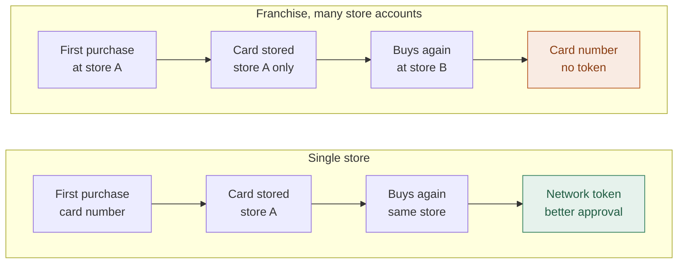

This page walks you through every step needed to start accepting payments with Yuno on your VTEX store. The setup happens in two places. Your **VTEX dashboard** is where you register Yuno as a payment provider, install the Payment App, and activate payment methods. Your **Yuno dashboard** is where you configure the webhook that keeps order status in sync.

### Before you start

Have the following ready:
*   A user with administrator access to your VTEX dashboard.
*   Your Yuno credentials, which you can find in your Yuno dashboard under **Developers → API Credentials**: **Account ID**, **Public API Key**, and **Private Secret Key**.

---

<Steps>
  <Step title="Configure Yuno as a payment provider">
    1.  In the **VTEX dashboard**, open the left-hand menu and go to **Store Settings → Payment → Providers**, then click **New Provider** at the top right.

    <Frame>
      
    </Frame>

    2.  In the **Select a provider** dialog, type `Yuno` in the search box and select **Yuno** from the results.

    <Frame>
      
    </Frame>

    3.  Fill in the provider configuration form and save. Once saved, the provider is registered, but no payment methods are active yet.

    <Accordion title="Field reference">
      | Field | Required | What it does |
      | :--- | :--- | :--- |
      | **Application Key / Application Token** | Yes | VTEX admin credentials the plugin uses to interact with VTEX on your behalf. See VTEX's guide on [generating Application Keys](https://help.vtex.com/docs/tutorials/api-keys#generating-internal-application-keys). |
      | **Automatic Settlement** | Yes | Defines when the payment is captured automatically after authorization. Applies to card and wallet payments only. |
      | **Affiliation Name** | Yes | A human-readable name for this Yuno integration. |
      | **Account ID** | Yes | Your Yuno **Account ID**, available in your Yuno dashboard. |
      | **Public API Key** | Yes | Your Yuno **Public API Key**. The prefix determines the environment. |
      | **Private Secret Key** | Yes | Your Yuno **Private Secret Key**. |
      | **Main Account Name** | Optional | For multi-account setups. |
      | **Main Account App key** | Optional | Application Key of the main VTEX account. |
      | **Main Account App token** | Optional | Application Token of the main VTEX account. |
      | **Soft Descriptor** | Optional | Custom text that appears on the shopper's card statement. |
      | **Create Customer** | Optional | When set to **Yes**, the plugin creates a corresponding customer record in Yuno. |
      | **VTEX IO orderPlaced page URL** | Optional | A custom URL where shoppers should be redirected after payment. |
      | **Payment Mode** | Optional | **Payment App** (modern) or **Legacy** (redirect). |
      | **Transaction Identification From** | Optional | **Yuno TID** or **Provider TID**. |
      | **Antifraud Providers for Split Orders** | Optional | Comma-separated antifraud providers (`RISKIFIED`, `CYBERSOURCE`, `SIGNIFYD`, `CIELO_CYBERSOURCE_FRAUD`) that receive the shared session for split orders. Defaults to `RISKIFIED` + `CYBERSOURCE` when left empty. |
      | **Vault Card for Order Modification** | Optional | When set to **Yes** (and **Create Customer** is also **Yes**), the plugin securely stores the card used on each order and allows the additional amount to be charged automatically if the order total later increases. This is the only field that authorizes additional charges: when it is **No**, an order-total increase is declined even if the card was stored for network tokens. See [Order modifications](#order-modifications-changed-order-totals). |
      | **Enable Network Tokens** | Optional | When set to **Yes** (and **Create Customer** is also **Yes**), the plugin securely stores each card on its first purchase and recognizes it on later purchases by the same customer, so Yuno can process repeat purchases with a network token instead of the card number. **The toggle has no effect until Yuno activates network tokens on the routes your store uses**: until then cards are stored but no tokens are issued. Contact your Yuno KAM or support to activate it. See [Network tokens](#network-tokens-repeat-card-purchases). |
    </Accordion>

    <Accordion title="Settlement Options">
      The **Automatic Settlement** field determines the timing of the capture for card and wallet payments. 

      | Option | Practical Behavior |
      | :--- | :--- |
      | **Use behavior recommended by payment processor** | **Immediate Capture**: The transaction is captured immediately after authorization. (Default) |
      | **Automatic capture immediately after payment authorization** | **Immediate Capture**: The transaction is captured immediately after authorization. Same as default. |
      | **Automatic capture immediately after anti-fraud analysis** | **Immediate Capture**: The transaction is captured immediately after authorization. |
      | **Disabled** | **Authorize Only**: The transaction is only authorized. Capture happens later when the order is **invoiced**. |
    </Accordion>

    <Note>
      **Environments**: The Yuno environment is determined by the prefix of your **Public API Key**: `dev_`, `staging_`, `sandbox_`, or `prod_`.
    </Note>

    <Tip>
      We suggest using **Use behavior recommended by payment processor** unless your business specifically requires capture after invoicing.
    </Tip>
  </Step>

  <Step title="Install the Yuno Payment App">
    After saving the provider configuration, install the Yuno Payment App from your VTEX dashboard.

    1.  In the **VTEX dashboard**, go to **Apps → App Management**.
    2.  Search for **Yuno** and select the **Yuno Payment App** in the list of available apps and open its **Settings**.

    <Frame>
      
    </Frame>

    3.  Click **Install** to complete the setup.

    Once installed, the Payment App takes care of rendering the Yuno checkout experience inside your VTEX checkout.
  </Step>

  <Step title="Activate payment methods">
    Now choose which payment methods you want to offer to your shoppers and route them through Yuno.

    1.  In the **VTEX dashboard**, go to **Store Settings → Payment → Settings → Payment Conditions**. Click the **+** button to add a payment condition.

    <Frame>
      
    </Frame>

    2.  Select the payment method you want to activate (for example, Visa, Mastercard, Pix, Apple Pay, or any of the generic **Yuno** methods, such as Yuno Card or Yuno Wallet).

    <Frame>
      
    </Frame>

    3.  In the **Process with provider** field, select the Yuno affiliation you configured in Step 1. Set the **Status** to **Active** and save.

    <Frame>
      
    </Frame>

    <Note>
      Repeat for every method you want to offer. You can review the full list of available methods in the [Overview](/docs/plugins/vtex) page.
    </Note>
  </Step>

  <Step title="Configure the webhook in your Yuno dashboard">
    The webhook keeps your VTEX orders in sync with Yuno's payment status updates. 

    1.  In the **Yuno dashboard**, open **Developers → Webhooks** and click **Add webhook**.
    2.  Fill in the form:
        *   **Name**: For example `VTEX webhook`.
        *   **Endpoint URL**: `https://{store_name}.myvtex.com/_v/yunopartnerbr.yuno/v4/webhook`, replacing `{store_name}` with your VTEX account name.
        *   **x-api-key** and **x-secret**: Enter any placeholder value (for example, `VTEX`).
    3.  Select all events and click **Add**.
  </Step>
</Steps>

---

## Advanced Scenarios

### Multi-affiliation

A single VTEX account can be connected to **more than one Yuno integration** when you need to process different payment methods through different Yuno accounts. For example, you can assign one Yuno account to credit cards and a different one to wallets.

To set this up, repeat Step 1 once per integration, giving each one a distinct **Affiliation Name**. Then, when activating payment methods, use the **Process with affiliation** field to choose which account should process it.

### Multi-account

If your business runs **multiple VTEX accounts** (for example, a franchise model sharing the same Yuno credentials), use the **Main Account** fields in the provider configuration:

*   **Main Account Name**: The name of the main VTEX account.
*   **Main Account App key** and **Main Account App token**: Application credentials of that main account.

When these fields are set, the plugin reads catalog and order data from the main account instead of the current one.

### Split orders (multiple sellers)

When a shopper's cart contains products from **different sellers or franchises**, VTEX splits the purchase into multiple suborders and authorizes each one independently. The Yuno integration detects this and processes **every** suborder, so the entire order is paid, not just the first part. A single antifraud session is shared across all of them.

This works automatically; no extra setup is required. If you want to control which antifraud providers receive the shared session, use the **Antifraud Providers for Split Orders** field in the provider configuration (see the field reference in Step 1). Valid values are `RISKIFIED`, `CYBERSOURCE`, `SIGNIFYD`, and `CIELO_CYBERSOURCE_FRAUD`; when left empty, it defaults to `RISKIFIED` + `CYBERSOURCE`.

### Antifraud session (device fingerprints)

Antifraud providers (Riskified, Signifyd, CyberSource, Cielo CyberSource) score a payment by matching the device data collected in the shopper's browser with the session id Yuno sends in the payment. For that match to work, the browser and the server must use the **same** session id.

The Yuno Payment App handles this for you: on the checkout page it reads the VTEX cart id (`window.vtexjs.checkout.orderFormId`) and reports it as the antifraud session id for `RISKIFIED`, `SIGNIFYD`, `CYBERSOURCE`, and `CIELO_CYBERSOURCE_FRAUD`. The Yuno Payment Connector sends the same `orderFormId` on the server side, so the session is consistent across the browser, every suborder of a split order, and the payment itself. No configuration is needed; if the cart id is not available, each provider falls back to its own generated session id and the payment is not blocked.

<Accordion title="Cielo CyberSource: merchant ID prefix">
  Cielo CyberSource requires the antifraud session id to start with your Cielo merchant ID (MID) prefix. Until this prefix is configurable in the Yuno dashboard, set it in your VTEX checkout custom JavaScript **before** the checkout loads:

  ```javascript
  window.yunoFingerprintPrefix = 'YOUR_MID_PREFIX_'
  ```

  The Payment App prepends it only to the `CIELO_CYBERSOURCE_FRAUD` session id (`YOUR_MID_PREFIX_<orderFormId>`); the other providers are not affected. When the variable is not defined, no prefix is applied.

  <Note>
    This global variable is an interim mechanism. Once the fingerprint prefix can be configured in the Yuno dashboard, it will no longer be needed.
  </Note>
</Accordion>

If you integrate the SDK directly instead of using the Payment App, pass the session ids yourself through the `deviceFingerprints` mount option. See [Direct SDK integration](/docs/plugins/vtex/direct-sdk-integration).

### Order modifications (changed order totals)

VTEX lets you **change an order after checkout**, when the final total turns out to be different from the amount that was authorized. This applies, for example, if you sell products **by weight**, where the exact total is only known once the order is picked and packed.

*   If the final total is the **same or lower**, VTEX captures only the final amount. No extra setup is required.
*   If the final total is **higher**, VTEX charges the difference as a **separate, automatic charge**. Since the shopper is no longer present and does not re-enter their card, Yuno charges the difference against the card they already used on the original order.

To enable automatic charges when an order total **increases**, configure the following in your provider settings **before** the orders you expect to modify are placed:

| Field | Value |
| :--- | :--- |
| **Vault Card for Order Modification** | **Yes**: stores the card on the original order so it can be charged again for the difference. |
| **Create Customer** | **Yes**: required, so the card is stored against a Yuno customer. Both fields must be enabled together. |
| **Automatic Settlement** | **Disabled** (recommended). The original payment is authorized at checkout and captured at invoicing. If the final total is **lower** than the authorized amount, only that lower amount is captured (a partial capture). If it is higher, the difference is charged as a separate additional charge. |

<Note>
  Order-total **increases** are supported for **credit cards only** (a VTEX restriction). The card is stored at the time of the original payment, so **Vault Card for Order Modification** and **Create Customer** must be enabled **before** the order is placed. Turning them on later does not apply to orders that already exist.
</Note>

<Note>
  **Franchises / multiple accounts:** enable **Vault Card for Order Modification** and **Create Customer** on **every** affiliation you use (each franchise or sub-account), and set the **Main Account** fields as described under [Multi-account](#multi-account).
</Note>

### Network tokens (repeat card purchases)

[Network tokens](/docs/security-and-compliance/network-tokens) replace the card number with a token issued by the card network (Visa, Mastercard, American Express). Paying with a network token instead of the card number improves approval rates for returning shoppers and keeps working when the card is reissued, because the network updates the token automatically.

Yuno can only attach a network token to a card it has securely stored. When **Enable Network Tokens** is on, the plugin stores each card the first time a customer pays with it and reuses that stored reference on every later purchase of the same card by the same customer. No storefront or Payment App change is needed; everything happens on the Yuno side of the integration.

#### What has to be switched on

| Requirement | Where |
| :--- | :--- |
| **Enable Network Tokens** | Provider configuration in VTEX (Step 1), set to **Yes**. Has no effect on its own. |
| **Create Customer** | Same place, set to **Yes**. The stored card is bound to a Yuno customer, so both fields are required together. |
| **Plugin 4.2.347+** | Every VTEX account that runs the plugin, including the account that authorizes rather than pays (see [Multiple accounts](#multiple-accounts-and-franchises)). |
| **Route activation** | Done by Yuno on the routes your store uses. Not something you can set yourself: contact your Yuno KAM or [support](/docs/security-and-compliance/network-tokens#1-let-yuno-provision-and-collect-network-tokens). Activation is per route, and routes belong to a Yuno Account ID, so each account you process with needs its own activation. |

<Warning>
  **Both sides are required.** Until Yuno activates network tokens on your routes, the plugin stores cards but every payment is still processed with the card number and no network token is issued. The reverse also holds: if network tokens are active on your routes but **Enable Network Tokens** and **Create Customer** are not set in VTEX, no card is stored and every payment remains a regular card-number transaction. Confirm the activation with your KAM or support before expecting any change in approval rates.
</Warning>

#### Enable it

In your provider configuration (Step 1), set the following two fields and save:

| Field | Value |
| :--- | :--- |
| **Enable Network Tokens** | **Yes**. Has no effect until Yuno activates network tokens on your routes (see above). |
| **Create Customer** | **Yes**: required, because the stored card is bound to a Yuno customer. Both fields must be enabled together; **Enable Network Tokens** has no effect on its own. |

<Frame>
  
</Frame>

#### What to expect

*   **First purchase with a card**: processed with the card number, as today. The card is stored at the end of that purchase.
*   **Later purchases of the same card by the same customer**: processed with the network token.
*   **Gradual ramp-up**: because every card's first purchase still uses the card number, you will see almost no network tokens on day one. The benefit builds up as customers return with a card they have already used on your store.
*   **Reissued cards** (for example, a new expiration date after a renewal) keep being recognized, so the network token continues to be used.
*   **Fallback**: if the stored reference is not available for any reason, the payment proceeds with the card number exactly as it does today. Enabling this feature never causes a payment to fail.
*   **VTEX subscriptions** are not affected. Recurring charges have their own stored-credential flow, which keeps working as described in the [FAQs](/docs/plugins/vtex/faqs).
*   Applies to all card payments processed through the plugin, including fraud-defense payments and [split orders](#split-orders-multiple-sellers).

<Note>
  **Order modifications are not affected.** Storing a card for network tokens does not by itself allow the plugin to charge it again. [Additional charges when an order total increases](#order-modifications-changed-order-totals) remain controlled only by **Vault Card for Order Modification**: with that field set to **No**, an order-total increase is declined even though the card is stored.
</Note>



Store B has no record of the card, so it is treated as a first purchase. The payment still succeeds; it falls back to the card number.

#### Multiple accounts and franchises

The card is stored in the VTEX account that **authorizes** the payment and is scoped to that account's Yuno **Account ID**. Keep this in mind in the following setups:

*   **Authorization and payment in different VTEX accounts** (for example, a B2B storefront that completes the payment in a second account): enable both fields on the affiliation of the account that **authorizes** the order, not only on the account that completes the payment. Both accounts must run plugin version **4.2.347 or later**.
*   **Franchises / multiple store accounts** (many store accounts sharing a main account): enable both fields on **every** franchise affiliation. A card stored by one store account is not shared with another, and a card stored under one Yuno Account ID is not visible to another, so each store builds its own card history. **The benefit therefore accrues per store**: a chain whose customers buy across several stores gets materially fewer tokenized payments than a single-store merchant, because each store only recognizes the cards first used in that same store. Route activation is also per Yuno Account ID, so Yuno must activate network tokens on the routes of **every** franchise account, not only the main one.

<Accordion title="Verifying the setup (for Yuno TAMs)">
  Place two orders with the same card and the same customer on the store, then look up the plugin logs for each order in Datadog and filter by the `step_function` attribute:

  | Order | Expected step functions |
  | :--- | :--- |
  | First purchase | `cardVaultLookup` reporting no stored card, followed by `cardVaultWrite` once the payment is created (the card is stored). |
  | Repeat purchase | `cardVaultLookup` reporting a match, followed by `cardVaultTokenPassed` (the stored reference was sent with the payment). |

  A repeat purchase that shows `cardVaultLookup` without a match usually means the two orders did not share the same Yuno customer (check **Create Customer**), were placed from different store accounts, or used a different card. If the stored reference is passed but the payment still shows a card number on the Yuno side, network tokens are not yet enabled on the route.
</Accordion>
