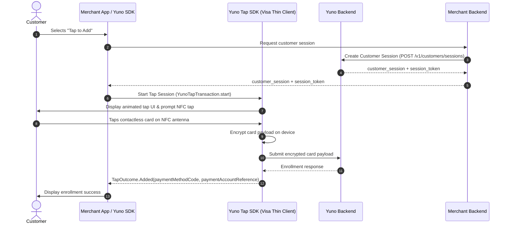

*Visa Tap to Add* enables customers to enroll their contactless cards by tapping them against the NFC antenna on their Android device.

<p align="center">
  
</p>

The tap interaction uses Visa's Thin Client Tap SDK under the hood: card details are read directly over NFC, encrypted on device, and submitted securely to Yuno. The merchant application never accesses or handles clear Primary Account Numbers (PANs).



---

## Prerequisites & Requirements

Your Android project must meet the following hardware, system, and toolchain requirements:

* **Hardware & OS**: Android 11.0 (API level 30) or higher with an active NFC antenna and Host Card Emulation (HCE) support.
* **Services**: Google Play Services must be available on the device.
* **Architecture**: 64-bit (`arm64-v8a`) or 32-bit (`armeabi-v7a`) ARM architecture. (x86 / x86_64 emulators are not supported for contactless NFC operations).
* **Toolchain Requirements**:
  * **Compile SDK**: `compileSdk 35`
  * **Java**: Java 17
  * **Kotlin**: 2.1.0 or higher
  * **Android Gradle Plugin (AGP)**: 8.6.0 or higher
  * **Gradle**: 8.7 or higher
  * **Hilt**: 2.56 or higher (if using dependency injection)
  * **Room**: 2.7.0-alpha13 or higher (if using Room in your project)

<Note>
**Supported Brands**: Currently, *Tap to Add* is powered by Visa's Tap SDK. Support for Mastercard and other card schemes will be introduced in subsequent releases.
</Note>

---

## Integration Paths

You can integrate Tap to Add in one of two ways:

1. **Path A: Automatic Enrollment via Yuno Android SDK 3.x (Recommended)**: If you already use Yuno's Full Checkout SDK for Android, adding the `yuno-tap` dependency automatically enables the Tap to Add entrypoint on the enrollment form with zero UI code.
2. **Path B: Standalone Yuno Tap SDK**: If you build custom enrollment screens or headless UI, integrate `com.yuno.payments:yuno-tap` directly with either the pre-built `YunoTapToAddButton` or the headless `YunoTapController`.

---

## Path A: Automatic Full Checkout Enrollment

When integrating with the Yuno Android Universal SDK (`3.0.0-alpha` or later), the SDK automatically inspects whether `yuno-tap` is present on the runtime classpath. If found and the device supports NFC, the SDK displays the **Tap to Add** option directly within the card enrollment form.

<Warning>
**Enrollment Only**: Tap to Add is exclusively supported for card enrollment and saving payment methods to a customer account. It is **never** presented during checkout, one-off payment flows, or direct purchase screens.
</Warning>

### 1. Add Dependencies

Add the Yuno Android SDK and Yuno Tap artifact to your module's `build.gradle.kts`:

```kotlin
dependencies {
    // Yuno Android SDK
    implementation("com.yuno.payments:android-sdk:3.0.0-alpha.1")

    // Yuno Tap SDK for Tap to Add
    implementation("com.yuno.payments:yuno-tap:0.3.0")
}
```

### 2. Configure Manifest for Devices below API 30

The Yuno Tap SDK enforces `minSdk = 30`. If your main application targets a lower `minSdkVersion` (for example, `minSdk = 24`), allow the manifest merger to proceed by adding a `tools:overrideLibrary` declaration in your `AndroidManifest.xml`:

```xml
<manifest xmlns:android="http://schemas.android.com/apk/res/android"
    xmlns:tools="http://schemas.android.com/tools">

    <uses-sdk tools:overrideLibrary="com.yuno.payments.tap" />

    <application>
        <!-- Application components -->
    </application>
</manifest>
```

On devices running Android 10 (API 29) or lower, the Yuno SDK gracefully detects the platform version and hides the Tap to Add option, falling back to manual card entry.

### Visual Flow

<ResponseField name="1. Enrollment Form Entrypoint">
  When `yuno-tap` is included in the project, the card enrollment form displays the **Tap to add** entrypoint above manual card entry.

  <p align="center">
    
  </p>
</ResponseField>

<ResponseField name="2. Contactless NFC Prompt">
  Selecting **Tap to add** launches the animated NFC tap interface prompting the customer to hold their contactless card to the back of the device.

  <p align="center">
    
  </p>
</ResponseField>

<ResponseField name="3. Success Confirmation">
  Once the card data is read and encrypted on device, Yuno securely completes the enrollment and returns a success confirmation.

  <p align="center">
    
  </p>
</ResponseField>


---

## Path B: Standalone Yuno Tap SDK

If you manage your own card capture UI or want custom placement of the Tap to Add action, use the standalone `yuno-tap` library.

### 1. Add Dependency

Add `yuno-tap` to your `build.gradle.kts`:

```kotlin
dependencies {
    implementation("com.yuno.payments:yuno-tap:0.3.0")
}
```

### 2. Obtain Customer Session

Before starting the tap flow, your backend must create a customer session using Yuno's server-to-server API:

```bash
curl -X POST https://api.yuno.com/v1/customers/sessions \
  -H "public-api-key: YOUR_PUBLIC_API_KEY" \
  -H "private-secret-key: YOUR_PRIVATE_SECRET_KEY" \
  -H "Content-Type: application/json" \
  -d '{
    "country": "US",
    "customer_id": "cust_12345"
  }'
```

The response returns a `customer_session` ID and a `session_token`. Pass both values to your Android application.

### 3. Initialize YunoTapConfig

Initialize the SDK in your `Application` class or main activity:

```kotlin
import android.app.Application
import com.yuno.payments.tap.YunoTapConfig
import com.yuno.payments.tap.model.YunoEnvironment

class MainApplication : Application() {
    override fun onCreate() {
        super.onCreate()

        YunoTapConfig.init(
            context = this,
            apiKey = "YOUR_PUBLIC_API_KEY",
            environment = YunoEnvironment.SANDBOX // Use YunoEnvironment.PRODUCTION in release builds
        )
    }
}
```

### 4. Option 1: Drop-in YunoTapToAddButton

The simplest standalone UI integration uses `YunoTapToAddButton`. Place it directly in your layout or Composable tree:

```xml
<com.yuno.payments.tap.ui.YunoTapToAddButton
    android:id="@+id/btnTapToAdd"
    android:layout_width="match_parent"
    android:layout_height="wrap_content"
    android:layout_margin="16dp" />
```

Attach your transaction parameters and completion callback in your Activity or Fragment:

```kotlin
import androidx.appcompat.app.AppCompatActivity
import android.os.Bundle
import android.widget.Toast
import com.yuno.payments.tap.ui.YunoTapToAddButton
import com.yuno.payments.tap.model.TapTransactionData
import com.yuno.payments.tap.model.TapFlow
import com.yuno.payments.tap.model.TapOutcome

class EnrollmentActivity : AppCompatActivity() {

    override fun onCreate(savedInstanceState: Bundle?) {
        super.onCreate(savedInstanceState)
        setContentView(R.layout.activity_enrollment)

        val btnTapToAdd = findViewById<YunoTapToAddButton>(R.id.btnTapToAdd)

        btnTapToAdd.setup(
            activity = this,
            data = TapTransactionData(
                customerSession = "YOUR_CUSTOMER_SESSION",
                sessionToken = "YOUR_SESSION_TOKEN",
                flow = TapFlow.Add
            )
        ) { outcome ->
            handleTapOutcome(outcome)
        }
    }

    private fun handleTapOutcome(outcome: TapOutcome) {
        when (outcome) {
            is TapOutcome.Added -> {
                // Card successfully enrolled
                val paymentMethodCode = outcome.paymentMethodCode
                val par = outcome.paymentAccountReference // Note: PAR may be null depending on issuer support
                Toast.makeText(this, "Card enrolled: $paymentMethodCode", Toast.LENGTH_SHORT).show()
            }
            is TapOutcome.Canceled -> {
                // User dismissed or canceled the tap sheet
            }
            is TapOutcome.Error -> {
                // Tap error occurred
                val errorCode = outcome.code
                val message = outcome.message
                Toast.makeText(this, "Error: $message ($errorCode)", Toast.LENGTH_LONG).show()
            }
        }
    }
}
```

### 4. Option 2: Programmatic YunoTapController

For custom UI or button designs, trigger the tap flow programmatically using `YunoTapController`:

```kotlin
import com.yuno.payments.tap.YunoTapController
import com.yuno.payments.tap.model.TapTransactionData
import com.yuno.payments.tap.model.TapFlow
import com.yuno.payments.tap.model.TapOutcome

class CustomEnrollmentActivity : AppCompatActivity() {

    private lateinit var tapController: YunoTapController

    override fun onCreate(savedInstanceState: Bundle?) {
        super.onCreate(savedInstanceState)
        setContentView(R.layout.activity_custom_enrollment)

        tapController = YunoTapController(this)

        findViewById<Button>(R.id.btnCustomTap).setOnClickListener {
            startTapEnrollment()
        }
    }

    private fun startTapEnrollment() {
        tapController.start(
            data = TapTransactionData(
                customerSession = "YOUR_CUSTOMER_SESSION",
                sessionToken = "YOUR_SESSION_TOKEN",
                flow = TapFlow.Add
            )
        ) { outcome ->
            when (outcome) {
                is TapOutcome.Added -> {
                    // Card successfully enrolled
                }
                is TapOutcome.Canceled -> {
                    // Dismissed by user
                }
                is TapOutcome.Error -> {
                    // Tap error occurred
                }
            }
        }
    }
}
```

---

## Result Handling & Outcomes

The callback returns a sealed `TapOutcome` object:

| Outcome | Properties | Description |
| :--- | :--- | :--- |
| `TapOutcome.Added` | `paymentMethodCode: String`<br />`paymentAccountReference: String?` | Contactless card successfully enrolled. `paymentAccountReference` (PAR) uniquely identifies the underlying account across tokens, but can be `null` depending on the issuing bank. |
| `TapOutcome.Canceled` | None | The user dismissed the tap prompt or closed the NFC sheet before completing the read. |
| `TapOutcome.Error` | `code: String`<br />`message: String`<br />`cause: Throwable?` | The tap operation failed (e.g., NFC timeout, unsupported scheme, or network error). |

---

## Error Codes

When `TapOutcome.Error` is returned, examine `outcome.code` to handle specific failure scenarios:

| Error Code | Meaning | Recommended Action |
| :--- | :--- | :--- |
| `TAP_NFC_NOT_SUPPORTED` | Device hardware does not support NFC or Host Card Emulation (HCE). | Hide Tap to Add UI and fallback to manual card input. |
| `TAP_NFC_DISABLED` | NFC is turned off in Android system settings. | Prompt user to enable NFC in system settings (`Settings.ACTION_NFC_SETTINGS`). |
| `TAP_CARD_NOT_SUPPORTED` | Scanned card is not supported (e.g., non-Visa card or unsupported card profile). | Prompt the customer to use another contactless Visa card or enter details manually. |
| `TAP_COMMUNICATION_ERROR` | NFC connection lost or interrupted before the cryptographic handshake finished. | Prompt the customer to tap and hold the card firmly against the back of the device. |
| `TAP_SESSION_EXPIRED` | The customer session token is invalid or expired. | Refresh the customer session token from your backend and restart the transaction. |
| `TAP_INTERNAL_ERROR` | An unexpected error occurred inside the Visa Thin Client SDK. | Log the error and offer standard manual card entry. |

---

## ProGuard & R8 Configuration

If your build has code shrinking enabled (`minifyEnabled = true`), include the following ProGuard rules in your `proguard-rules.pro` file:

```proguard
# Yuno Tap SDK
-keep class com.yuno.payments.tap.** { *; }
-dontwarn com.yuno.payments.tap.**

# Visa Thin Client SDK
-keep class com.visa.mpos.** { *; }
-dontwarn com.visa.mpos.**
```

---

## Upcoming Features

* **Tap to Confirm**: Support for contactless card authentication during checkout transactions is planned for future SDK releases. Currently, only **Tap to Add** (`TapFlow.Add`) for card enrollment is active.
