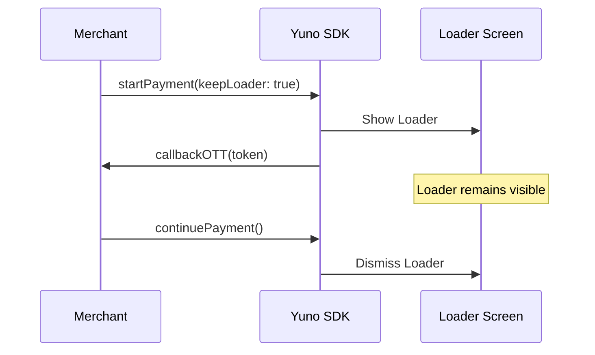

Parameters, customizations, and advanced features for all Android SDK flows. Setup: [Payment flows (Android)](/docs/sdks/full-checkout/android-payments), [Enrollment flows (Android)](/docs/sdks/card-enrollment/android-enrollment), [integration modes](/docs/sdks/overview/choose-integration).

## Key parameters (checkout session creation)

When creating a checkout session on your backend for payment flows, the following parameters are commonly used across Android SDKs:

<div className="nowrap-col1-table dense-table">

| Parameter            | Required | Description                                                                                                                                                                                                                                                                                                        |
| -------------------- | -------- | ------------------------------------------------------------------------------------------------------------------------------------------------------------------------------------------------------------------------------------------------------------------------------------------------------------------ |
| `amount`             | Yes      | The primary transaction amount object containing `currency` (ISO 4217 code) and `value` (numeric amount in that currency).                                                                                                                                                                                         |
| `alternative_amount` | No       | An alternative currency representation of the transaction amount with the same structure as `amount` (`currency` and `value`). Useful for multi-currency scenarios. For example, you can display prices to customers in their preferred currency (for example, USD) while processing the payment in the local currency (for example, COP). |

</div>

## Payment parameters (full reference)

Parameters for payment flows. All parameters used in [Payment flows (Android)](/docs/sdks/full-checkout/android-payments) are listed here with full detail.

<div className="nowrap-col1-table dense-table">

| Parameter               | Type     | Required | Description                                                                                                                                                                                                                                                                 |
| ----------------------- | -------- | -------- | --------------------------------------------------------------------------------------------------------------------------------------------------------------------------------------------------------------------------------------------------------------------------- |
| `checkoutSession`       | string   | Yes      | Checkout session ID from your backend (Create checkout session API). Required for all payment flows.                                                                                                                                                                         |
| `countryCode`           | string   | Yes      | ISO country code where the payment runs (for example, `US`, `BR`). Determines available payment methods and compliance.                                                                                                                                                            |
| `callbackPaymentState`| function | No       | `((String?, String?, StatusMessage?) -> Unit)?`. Invoked with the payment state (`SUCCEEDED`, `FAIL`, `PROCESSING`, `REJECT`, `INTERNAL_ERROR`, `CANCELED_BY_USER`), its sub-state and, on error outcomes, a [`StatusMessage?`](#statusmessage-error-details). Third parameter added in SDK `2.22.0`. Use for UI updates, analytics, or navigation. |
| `merchantSessionId`     | string   | No       | Optional merchant session identifier. Use to correlate the SDK session with your own session or order ID.                                                                                                                                                                   |
| `onInstallmentSelected` | function | No       | Callback invoked when the shopper selects an installment option in the card form (`InstallmentSelected?` payload with `installment`, `label`, and `amount`). Fires for the default pre-selection, every selection, plan recalculations, and once with `null` when installments stop being available. Available from SDK `2.20.0`. See [Full (Android)](/docs/sdks/full-checkout/android-payments#installment-selection-callback-oninstallmentselected).      |

</div>

## YunoConfig options (initialize)

Runtime behavior and appearance are configured via the `YunoConfig` data class when calling `Yuno.initialize(context, publicApiKey, config)`. All parameters used across Android payment and enrollment flows are listed below. For visual styling (fonts, colors, buttons), see [SDK customizations (Android)](/docs/sdks/customization/android).

<div className="nowrap-col1-table dense-table">

| Parameter          | Type    | Required | Description                                                                                                                                                                                                                                                                 |
| ------------------ | ------- | -------- | --------------------------------------------------------------------------------------------------------------------------------------------------------------------------------------------------------------------------------------------------------------------------- |
| `saveCardEnabled`  | boolean | No       | When `true`, allows the user to save or enroll the card during payment. Requires backend support for vaulting (for example, `payment_method.vault_on_success` in checkout session).                                                                                               |
| `keepLoader`       | boolean | No       | If `true`, the SDK loader persists from OTT generation until `continuePayment()` is called. This prevents UI flickering. If payment creation fails, call `hideLoader()` to manually dismiss it. |
| `language`         | string  | No       | Language code for the SDK UI (for example, `en`, `es`). Use a code from [Supported languages](/docs/sdks/resources/languages-supported) when available.                                                                                                                     |
| `styles`           | object  | No       | Custom styles applied to SDK UI elements. Define styles in your app and reference them here, or use theme overrides. See [SDK customizations (Android)](/docs/sdks/customization/android) for font, button, and color options.                                                       |

</div>

## Enrollment parameters (full reference)

Parameters for enrollment flows. All parameters used in [Enrollment flows (Android)](/docs/sdks/card-enrollment/android-enrollment) are listed here with full detail.

<div className="nowrap-col1-table dense-table">

| Parameter                | Type     | Required | Description                                                                                                                                                                                                                                                                 |
| ------------------------ | -------- | -------- | --------------------------------------------------------------------------------------------------------------------------------------------------------------------------------------------------------------------------------------------------------------------------- |
| `customerSession`        | string   | Yes      | Customer session ID from Create customer session API. Required. Associates the enrolled payment method with a specific customer.                                                                                                                                             |
| `countryCode`            | string   | Yes      | ISO country code (for example, `US`, `BR`). Required for enrollment.                                                                                                                                                                                                                 |
| `showEnrollmentStatus`   | boolean  | No       | When `true`, shows the enrollment result screen after the flow. Default `true`. Set to `false` to handle result only via callback.                                                                                                                                          |
| `callbackEnrollmentState`| function | No       | `((String?, StatusMessage?) -> Unit)?`. Invoked with the enrollment state and, on `INTERNAL_ERROR`, a [`StatusMessage?`](#statusmessage-error-details). Second parameter added in SDK `2.22.0`. Requires registering `initEnrollment` in your Activity's `onCreate` (or equivalent). Optional when using `onActivityResult` with `requestCode`. |
| `requestCode`            | int      | No       | Optional request code used when capturing the enrollment result via `onActivityResult`. Use when you prefer activity-result flow over callbacks.                                                                                                                              |

</div>

## Public methods

The following methods are available globally via the `Yuno` object or as `Activity` extensions.

### `Activity.hideLoader()`

Dismisses the SDK loader when `keepLoader` is active. Use this method when a backend payment creation fails. It is also useful when you cannot proceed with `continuePayment()`.

```kotlin
fun Activity.hideLoader()
```

### `Yuno.continuePayment()`

Resumes the payment flow for asynchronous methods (3ds, PIX, etc.) after a payment has been created on your backend.

```kotlin
fun continuePayment(
    showPaymentStatus: Boolean = true,
    checkoutSession: String? = null,
    countryCode: String? = null,
    callbackPaymentState: ((String?, String?, StatusMessage?) -> Unit)? = null
)
```

## StatusMessage (error details)

> **Available since Android SDK v2.22.0**

Every payment and enrollment result callback, and the `returnStatus` of the render listeners, carries a `StatusMessage?` next to the state. It tells a **backend rejection** apart from an **SDK-internal failure** and gives you a code to act on, instead of a flat status string.

```kotlin
package com.yuno.payments.features.payment.models

data class StatusMessage(
    val source: String,          // "backend" or "sdk"
    val code: String? = null,    // backend response_code, or an SDK error code
    val reason: String? = null,  // human-readable detail
    val raw: String? = null,     // redacted subset of the backend error body (backend only)
    val context: String? = null, // where the SDK failed (sdk only), e.g. "startPayment"
)
```

| Field | `source = "backend"` | `source = "sdk"` |
| --- | --- | --- |
| `code` | The transaction `response_code` (for example `INSUFFICIENT_FUNDS`) or the HTTP error `code` returned by Yuno. | An SDK error code: `UNEXPECTED_ERROR`, `LOADER_TIMEOUT` or `PAYMENT_METHOD_NOT_SELECTED` (from `2.25.0`). |
| `reason` | The transaction `response_message`, falling back to its `reason`; for HTTP errors, the first backend `messages` entry. | A short description of the failure. |
| `raw` | Allowlisted, size-capped subset of the backend error body: only `code`, `message`, `messages`, `type` and `request_id`, at most 2048 characters, otherwise `null`. It can still echo data you submitted, so do not log it verbatim. | Always `null`. |
| `context` | Always `null`. | The SDK step that failed, for example `startPayment`, `continuePayment` or `enrollment`. |

When it is populated:

| Outcome | `message` |
| --- | --- |
| `SUCCEEDED`, `PROCESSING`, `CANCELED_BY_USER` (payments) / `CANCELED` (enrollment), user drop-off | Always `null`. |
| `INTERNAL_ERROR` | Always present. `source = "sdk"` for SDK, render or network failures; `source = "backend"` when Yuno answered an HTTP error. |
| `REJECT`, `FAIL` (payments) | Present with `source = "backend"` only when the backend returned a `response_code` for the transaction; `null` otherwise. |
| `REJECT`, `FAIL` (enrollment) | `null`: enrollment declines carry no backend `response_code`. |

```kotlin
callbackPaymentState = { state, subState, message ->
    when (state) {
        "REJECT", "FAIL" -> showDeclined(code = message?.code, reason = message?.reason)
        "INTERNAL_ERROR" -> when (message?.source) {
            "backend" -> reportBackendError(message.code, message.raw)
            else -> reportSdkError(message?.code, message?.context)
        }
        else -> { }
    }
}
```

### Render integration

If you integrate through the render API, the same value reaches your listeners as the last parameter of `returnStatus`:

```kotlin
interface YunoPaymentRenderListener {
    fun returnStatus(
        resultCode: Int,
        paymentStatus: String,
        paymentSubStatus: String? = null,
        message: StatusMessage? = null,
    )
    // showView, returnOneTimeToken, loadingListener unchanged
}

interface YunoEnrollmentRenderListener {
    fun returnStatus(resultCode: Int, paymentStatus: String, message: StatusMessage? = null)
    // showView, loadingListener unchanged
}
```

### Migrating to 2.22.0

`StatusMessage` is a **breaking change**: the SDK does not ship deprecated overloads of the previous signatures. When you upgrade from `2.21.x` or earlier:

1. **Recompile your app against the new SDK.** Dropping the new AAR into an app built against an older version is not safe: a render listener compiled with the old `returnStatus` signature crashes at runtime with `AbstractMethodError` on the first error outcome, with no compile-time warning.
2. **Add the third parameter to every `callbackPaymentState` lambda** (`startCheckout`, `startPaymentSeamlessLite`, `continuePayment`, `continueCardPayment`): `{ state, subState -> }` becomes `{ state, subState, message -> }`. Kotlin lambdas must match the arity, so the old form fails to compile.
3. **Add the second parameter to every `callbackEnrollmentState` lambda** (`initEnrollment`, `startEnrollment`): `{ state -> }` becomes `{ state, message -> }`.
4. **Update your `returnStatus` overrides** in `YunoPaymentRenderListener` and `YunoEnrollmentRenderListener` to the signatures above.

Reading `message` is optional: ignoring the new parameter keeps your existing logic working. Release notes: [Android changelog](/changelog/android).

## Enrolling payment methods

You can enroll payment methods (store cards for future use) during the payment flow or via dedicated enrollment flows. For payment flows, enable save card in `YunoConfig`. Also set `payment_method.vault_on_success` (or equivalent) when creating the checkout session, where supported. For dedicated enrollment, see [Enrollment flows (Android)](/docs/sdks/card-enrollment/android-enrollment).

## `keepLoader` parameter

> **Available since Android SDK v2.13.0**

### How it works

The `keepLoader` parameter allows you to persist the SDK's loading indicator across the entire `startPayment` → `continuePayment` flow. This prevents the loader from flickering between steps.

By default, the SDK hides its loader after generating the One-Time Token (OTT). It shows the loader again when `continuePayment` is called. With `keepLoader` enabled, the loader stays visible continuously from the moment the user submits the payment form until the payment is fully processed (or explicitly dismissed).



### Integration

#### 1. Enable in YunoConfig

```kotlin
Yuno.initialize(
    applicationContext = this,
    apiKey = "YOUR_PUBLIC_API_KEY",
    config = YunoConfig(
        keepLoader = true,
    ),
)
```

#### 2. Handle OTT and call `continuePayment`

When `keepLoader` is enabled, the OTT callback fires while the loader is still visible. Create your payment on your backend and then call `continuePayment` as usual:

```kotlin
activity.startCheckout(
    checkoutSession = checkoutSession,
    countryCode = countryCode,
    callbackOTT = { token ->
        // The loader is still visible at this point.
        // Create payment on your backend using the token,
        // then call continuePayment:
        activity.continuePayment(showPaymentStatus = true)
    },
    callbackPaymentState = { state, subState, message ->
        // Handle final payment state
    },
)
```

#### 3. Handle errors with `hideLoader`

If your backend call fails and you cannot proceed with `continuePayment`, call `hideLoader()`. This dismisses the loader and finishes the payment flow:

```kotlin
callbackOTT = { token ->
    try {
        val payment = createPaymentOnBackend(token)
        activity.continuePayment(showPaymentStatus = true)
    } catch (e: Exception) {
        // Dismiss the loader on failure
        activity.hideLoader()
    }
}
```

<Warning>
  **Handling Failures**  
  When `keepLoader` is active and payment creation fails, you **must** call `hideLoader()`. Otherwise, the loader will remain on the screen indefinitely (until the built-in timeout triggers).
</Warning>

### Compatibility

- Works with both **Full** and **Lite** payment flows (`startPayment` and `startPaymentLite`).
- Compatible with vaulted tokens.
- The loader respects the SDK's built-in timeout. If neither `continuePayment` nor `hideLoader` is called, the loader will automatically dismiss after the timeout period.
- Not applicable to the **Seamless** flow (`startPaymentSeamlessLite`). This flow does not use the `startPayment` → `continuePayment` two-step pattern.
