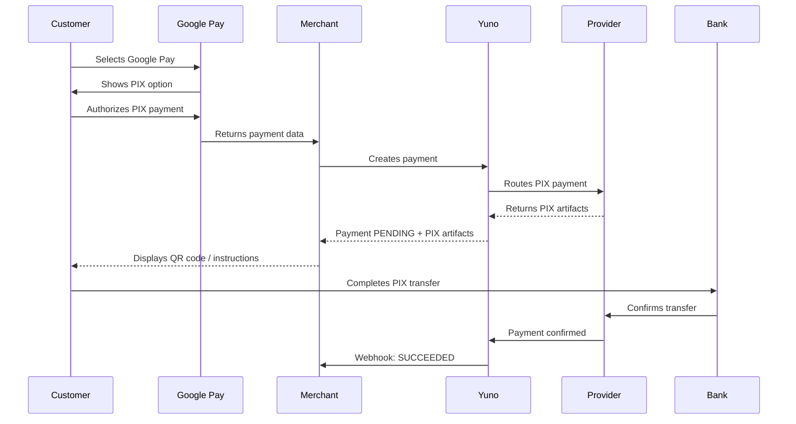
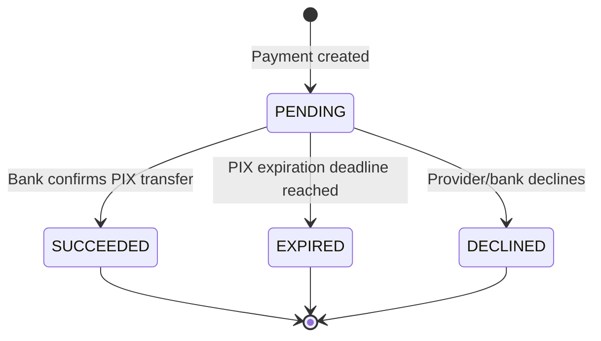

In Brazil, Yuno supports Google Pay™ as an interface for PIX payments. Customers select Google Pay at checkout, and the payment is processed through PIX, Brazil's instant payment system. This combines the convenience of Google Pay's stored payment methods with PIX's real-time settlement.

<Note>
  Google Pay with PIX is available only in Brazil, with transactions in BRL (Brazilian Real).
</Note>

## What is Google Pay PIX

Google Pay PIX uses **Open Finance** to enable PIX payments through the Google Pay wallet. Instead of opening their banking app to complete a PIX transfer, customers can pay directly from their Google Wallet, making the checkout experience faster and more convenient.

To pay with Google Pay PIX, the end customer must first configure a bank account for PIX payments inside their Google Wallet. Google provides setup instructions at [Set up PIX in Google Wallet](https://support.google.com/wallet/answer/14600929?hl=pt-BR).

## How it works

From the merchant's perspective, a Google Pay + PIX payment behaves like a standard asynchronous PIX payment, even though the customer starts in Google Pay.

1. The customer selects Google Pay at checkout.
2. Google Pay presents PIX as a payment option within the Google Pay payment sheet.
3. The customer selects a bank or credential that can initiate a PIX transfer and authorizes the payment.
4. Yuno creates the payment in `PENDING` status and returns the standard PIX artifacts (QR code, copy-and-paste code, or deeplink) depending on the provider and configuration.
5. The customer completes the PIX transfer through their bank.
6. The bank confirms the transfer to the provider, which notifies Yuno.
7. Yuno updates the payment status to `SUCCEEDED` and fires a webhook.



## Supported providers

Google Pay PIX is currently available through the following providers:

* **Adyen**
* **Santander**
* **Itau**

For other providers, contact your Yuno account manager to discuss availability and prioritize integration.

## Requirements

* A Yuno account with a connection to a [supported provider](#supported-providers)
* Transactions must be in **BRL** (Brazilian Real)
* The customer must have a bank account configured for PIX in their [Google Wallet](https://support.google.com/wallet/answer/14600929?hl=pt-BR)

## Integration

Google Pay with PIX follows the same integration patterns as Google Pay with card payments. Choose the integration method that fits your architecture:

* **[SDK integration](/docs/google-pay-sdk-integration)**: Yuno's SDK handles the full flow, including presenting PIX as an option within Google Pay.
* **[Direct integration](/docs/google-pay-direct-integration)**: You manage the Google Pay frontend and pass the PIX payment token to Yuno.
* **[Provider integration](/docs/integration-via-provider-google-pay)**: Your payment provider handles the Google Pay + PIX flow.

When creating the payment, set the `payment_method.type` to `GOOGLE_PAY_PIX`. This tells Yuno the payment is a PIX transaction initiated through Google Pay.

## Payment request

Create a payment using the `GOOGLE_PAY_PIX` payment method type. Set the country to `BR` and the currency to `BRL`:

```json
{
  "account_id": "your-account-id",
  "description": "Google Pay PIX payment",
  "merchant_order_id": "order-456",
  "country": "BR",
  "amount": {
    "currency": "BRL",
    "value": 5000
  },
  "customer_payer": {
    "email": "customer@example.com"
  },
  "payment_method": {
    "type": "GOOGLE_PAY_PIX"
  }
}
```

<Note>
  For Google Pay PIX, use `payment_method.type = GOOGLE_PAY_PIX` instead of `GOOGLE_PAY`. This is different from Google Pay card payments, which use `GOOGLE_PAY`.
</Note>

## Payment statuses

Google Pay with PIX is **asynchronous**. Unlike card payments through Google Pay, which typically resolve immediately, PIX payments go through a pending state while waiting for the bank transfer to complete.

| Status      | Description                                                       |
| ----------- | ----------------------------------------------------------------- |
| `PENDING`   | Payment created. The PIX transfer has not been completed yet.     |
| `SUCCEEDED` | The bank confirmed the PIX transfer. Funds have settled.          |
| `EXPIRED`   | The PIX payment was not completed before the expiration deadline. |
| `DECLINED`  | The payment was declined by the provider or bank.                 |

### Status lifecycle



## Handling user cancellation

If the customer closes the Google Pay sheet or the PIX instructions screen before completing the bank transfer:

* The **frontend/SDK** reports that the user left the flow (e.g., the SDK returns a user-cancelled status).
* The **payment in the API remains `PENDING`**. The PIX reference is still valid and the customer can still complete the transfer from their bank app.
* The PIX payment only moves to `EXPIRED` when the expiration deadline is reached, not when the user closes the UI.

Your checkout should handle this by:

1. **Re-displaying the PIX instructions** if the customer returns to the same session, since the PIX reference is still valid.
2. **Letting the customer pay later** if your UX supports it. The PIX code remains active until it expires.
3. **Polling the payment status** via `GET /v1/payments/{id}` or listening for webhooks to detect when the transfer completes.

## Webhooks

Standard payment webhooks fire for all status transitions. The webhook payload follows the same structure as any other Yuno payment notification.

Monitor these events:

* **Payment succeeded**: The PIX transfer was completed. Update your order status and confirm to the customer.
* **Payment expired**: The PIX deadline passed without a transfer. Stop displaying the QR code or PIX instructions and prompt the customer to start a new payment.

See [Webhooks](/docs/webhooks) for configuration details.

## Differences from card payments

| Aspect                         | Google Pay with cards            | Google Pay with PIX                           |
| ------------------------------ | -------------------------------- | --------------------------------------------- |
| Processing                     | Usually synchronous              | Asynchronous (PENDING until bank confirms)    |
| Settlement                     | Depends on provider and acquirer | Instant (PIX network)                         |
| Currency                       | Multiple currencies supported    | BRL only                                      |
| Country                        | Global availability              | Brazil only                                   |
| Refunds                        | Standard refund flow             | PIX refund flow                               |
| Recurring payments             | Supported via vaulted tokens     | Not supported                                 |
| Customer action after checkout | None required                    | Must complete PIX transfer via bank           |
| Expiration                     | N/A                              | PIX reference expires per provider/Yuno rules |

## Related documentation

* [Google Pay overview](/docs/google-pay)
* [Google Pay SDK integration](/docs/google-pay-sdk-integration)
* [Google Pay Direct integration](/docs/google-pay-direct-integration)
* [Google Pay via provider](/docs/integration-via-provider-google-pay)