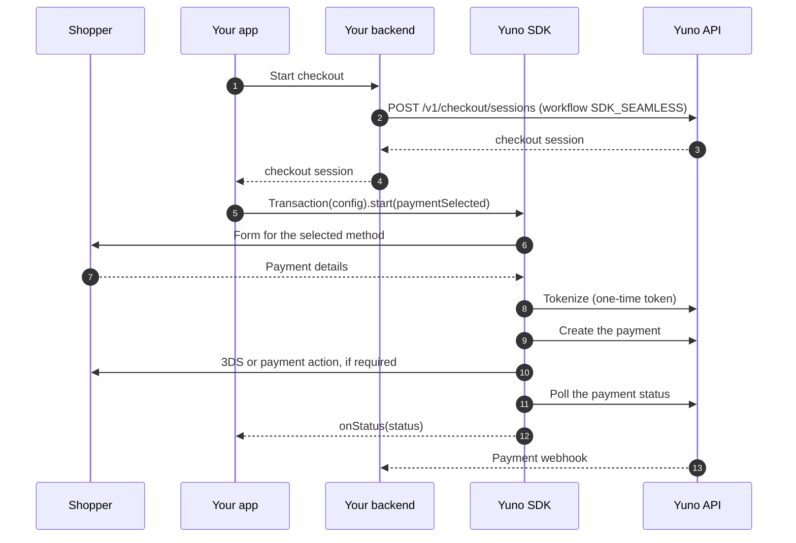
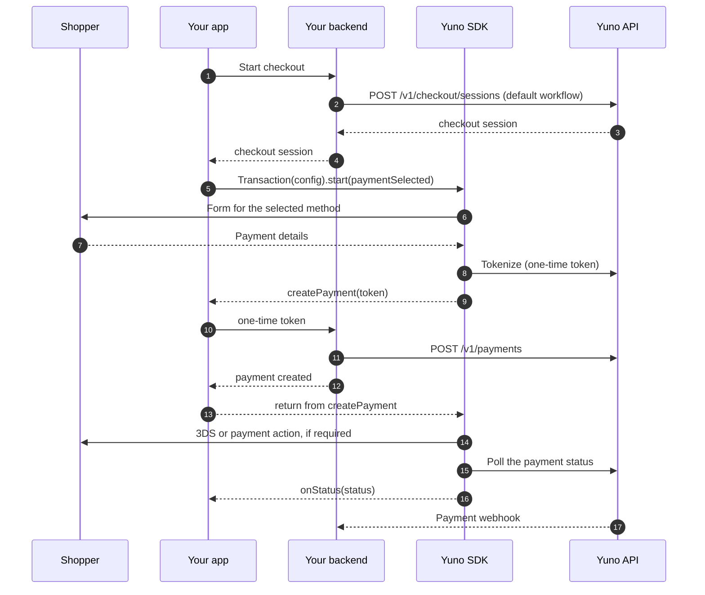
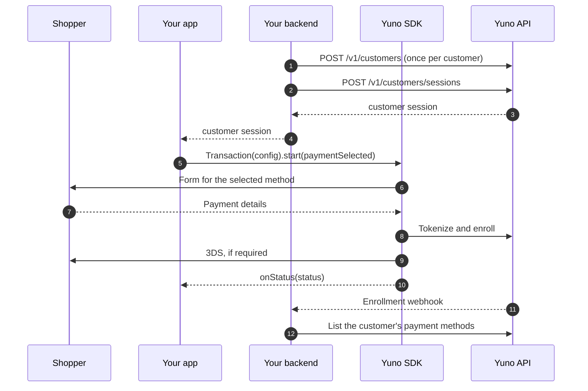

Every integration runs the same sequence: your backend creates a session, your app starts a `Transaction`, the SDK takes the shopper to a final status and reports it to `onStatus`, and Yuno confirms the outcome to your backend. What changes between integrations is who creates the payment and which session you pass. The three flows below cover every case.

## The default flow: the SDK creates the payment

Create the checkout session with `workflow: "SDK_SEAMLESS"` and do not override `createPayment`. The SDK does everything between `start` and `onStatus`.

1. Your backend creates the checkout session and hands its ID to your app.
2. Your app initializes the SDK once, builds a `TransactionConfig` with the session and your controller, and calls `start` with the method the shopper picked.
3. The SDK renders the method's form, or skips it when you pass `transactionData`, and tokenizes the details into a one-time token.
4. The SDK creates the payment with that token, runs 3DS or any other action the method needs, and polls the status until it is final.
5. `onStatus` receives the final status once. If `showStatusScreen` is `true`, the SDK also shows its result screen.
6. Yuno sends the payment webhook to your backend. Confirm the outcome there before fulfilling the order.

## When your backend creates the payment

Override `createPayment` and keep the default session workflow (`SDK_CHECKOUT`). The SDK pauses after tokenization, hands you the token, and resumes when your handler returns.

The difference is steps 9 to 13: the SDK delivers the one-time token to `createPayment`, your backend creates the payment, and returning from the handler is what resumes the flow. If the handler throws, the flow stops and `onStatus` is not called. Set `autoContinuePayment` to `false` only if you need the SDK to stop right after the payment is created.

<Warning>
The session `workflow` must match who creates the payment. A default-workflow session with no `createPayment` override ends in `INTERNAL_ERROR`: the backend rejects the SDK's payment creation. See [`createPayment`](/docs/yuno-sdk/controllers/create-payment).
</Warning>

## Enrollment: save a method without charging

Pass a `customerSession` instead of a `checkoutSession`. There is no payment to create, so `createPayment` is never invoked.

The vaulted token is never delivered to the app. After `onStatus` reports success, your backend reads the enrolled method from Yuno and uses its vaulted token for future payments.

## Where each step is documented

| Step | Page |
|---|---|
| Creating sessions and the first payment | [Get Started](/docs/yuno-sdk/get-started) |
| Choosing who creates the payment, collects the data, renders the form | [Where do I start?](/docs/yuno-sdk/where-do-i-start) |
| `createPayment` and the session workflow | [`createPayment`](/docs/yuno-sdk/controllers/create-payment) |
| The final status and confirming it on your server | [`onStatus`](/docs/yuno-sdk/controllers/on-status) |
| Enrollment with a customer session | [Enrollment](/docs/yuno-sdk/features/enrollment) |
| Returning from an external app or page (iOS) | [Handle deeplinks](/docs/yuno-sdk/features/handle-deeplinks) |
