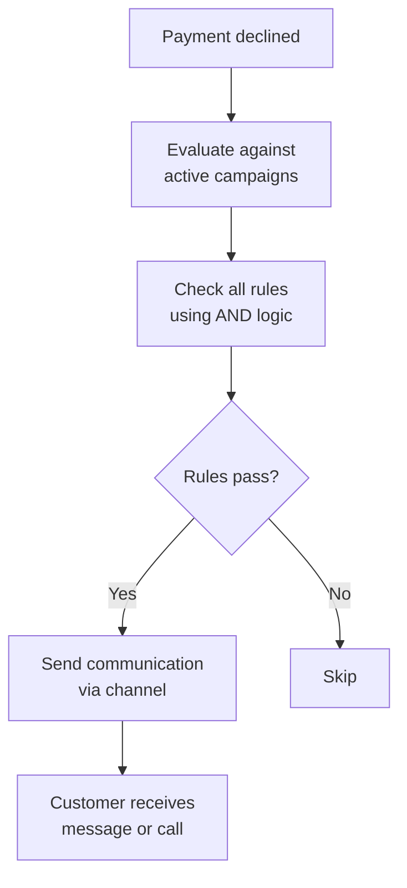

Learn how to integrate with the Yuno Campaigns API to automate personalized communications for declined payment recovery.

## Endpoints

* [Create campaign](ref:create-campaign)
* [List campaigns](ref:list-campaigns)
* [Get campaign](ref:get-campaign)
* [Update campaign status](ref:update-campaign-status)
* [Create rules](ref:create-rules)
* [Get rule](ref:get-rule)
* [Update rule](ref:update-rule)
* [Update rule status](ref:update-rule-status)

## Overview

The Campaigns API allows you to create automated communication campaigns that are triggered when a customer's payment is declined. When a payment event matches your campaign's targeting rules, Yuno automatically sends a personalized message to the customer through the configured channel (WhatsApp or phone call), helping recover the failed transaction.

### Key concepts

* **Campaign**: Defines who to target, through which channel, and when to send communications.
* **Rules**: Conditions attached to a campaign that determine which declined payments qualify. All active rules must pass for a payment to trigger the campaign (AND logic).
* **Schedule**: Controls the daily time window and timezone for sending communications.
* **Duration**: The start and end dates during which the campaign is active.

## How it works



**Example**: You create a campaign targeting declined payments in Colombia with amounts over 50,000 COP. When a Colombian customer's 80,000 COP payment is declined, Yuno automatically sends them a WhatsApp message with a personalized recovery suggestion.

## Authentication

All API requests require the following headers:

| Header                 | Description                                        | Required |
| ---------------------- | -------------------------------------------------- | -------- |
| `X-Public-Api-Key`     | Your merchant public API key                       | Yes      |
| `X-Private-Secret-Key` | Your merchant private secret key                   | Yes      |
| `Content-Type`         | Must be `application/json` for POST/PATCH requests | Yes      |

```bash
curl -X GET https://api-sandbox.y.uno/v1/campaigns \
  -H "X-Public-Api-Key: your-public-api-key" \
  -H "X-Private-Secret-Key: your-private-secret-key"
```

## Data models

### Campaign object

| Field               | Type   | Description                                            |
| ------------------- | ------ | ------------------------------------------------------ |
| `id`                | UUID   | Unique campaign identifier                             |
| `name`              | string | Campaign name                                          |
| `account_id`        | UUID   | Yuno account ID                                        |
| `organization_code` | UUID   | Organization identifier                                |
| `country`           | string | ISO 3166-1 alpha-2 country code                        |
| `channel`           | string | `WHATSAPP_MESSAGE` or `PHONE_CALL`                     |
| `focus`             | string | Optional campaign focus descriptor                     |
| `schedule`          | object | Scheduling configuration                               |
| `duration`          | object | Campaign active period                                 |
| `status`            | string | `ACTIVE`, `PAUSED`, `COMPLETED`, or `CANCELLED`        |
| `rules`             | array  | Rules attached to the campaign (included in GET by ID) |
| `created_at`        | string | ISO 8601 creation timestamp                            |
| `updated_at`        | string | ISO 8601 last update timestamp                         |

### Rule object

| Field          | Type   | Description                                     |
| -------------- | ------ | ----------------------------------------------- |
| `id`           | UUID   | Unique rule identifier                          |
| `campaign_id`  | UUID   | ID of the campaign this rule belongs to         |
| `rule_type`    | string | Type of rule (see reference below)              |
| `values`       | array  | Array of string values for comparison           |
| `conditional`  | string | Comparison operator (see reference below)       |
| `metadata_key` | string | Metadata field name (only for `METADATA` rules) |
| `status`       | string | `ACTIVE` or `INACTIVE`                          |
| `created_at`   | string | ISO 8601 creation timestamp                     |
| `updated_at`   | string | ISO 8601 last update timestamp                  |

### Rule types reference

Rules define which declined payments qualify for a campaign. All active rules on a campaign must pass (AND logic) for a communication to be triggered.

#### Payment data rules

These rules evaluate data directly available from the payment event.

| Rule Type             | Description                      | Values Format            | Example            |
| --------------------- | -------------------------------- | ------------------------ | ------------------ |
| `AMOUNT`              | Filter by payment amount         | `["number"]`             | `["50000"]`        |
| `CURRENCY`            | Filter by currency code          | `["code"]`               | `["COP"]`          |
| `AMOUNT_AND_CURRENCY` | Combined amount + currency check | `["amount", "currency"]` | `["50000", "COP"]` |
| `PAYMENT_STATUS`      | Filter by payment status         | `["status"]`             | `["DECLINED"]`     |

#### Enriched data rules

These rules evaluate enriched transaction data (payment method, provider, card details, etc.).

| Rule Type           | Description                      | Values Format     | Example                |
| ------------------- | -------------------------------- | ----------------- | ---------------------- |
| `PAYMENT_METHOD`    | Filter by payment method type    | `["method"]`      | `["CARD"]`             |
| `PROVIDER`          | Filter by payment provider ID    | `["provider_id"]` | `["stripe"]`           |
| `CARD_BIN`          | Filter by card BIN/IIN prefix    | `["bin_prefix"]`  | `["411111", "552345"]` |
| `RESPONSE_CODE`     | Filter by provider response code | `["code"]`        | `["05", "51"]`         |
| `ISO_RESPONSE_CODE` | Filter by ISO 8583 response code | `["code"]`        | `["51", "05"]`         |
| `CATEGORY`          | Filter by transaction category   | `["category"]`    | `["ecommerce"]`        |

#### Metadata rules

Evaluate custom metadata fields attached to the payment.

| Rule Type  | Description                         | Values Format | Requires `metadata_key` |
| ---------- | ----------------------------------- | ------------- | ----------------------- |
| `METADATA` | Filter by custom metadata key-value | `["value"]`   | Yes                     |

**Example**: Target payments from a specific business vertical:

```json
{
  "rule_type": "METADATA",
  "metadata_key": "vertical",
  "values": ["restaurant", "grocery"],
  "conditional": "ONE_OF"
}
```

#### Rate limiting rules

Control communication frequency to avoid sending too many messages to the same user.

| Rule Type            | Description                             | Values Format  | Example |
| -------------------- | --------------------------------------- | -------------- | ------- |
| `USER_COMMS_PER_DAY` | Max communications per user per day     | `["limit"]`    | `["3"]` |
| `UNIQUE_BY_USER`     | One communication per user per campaign | Not applicable | -       |

**Important notes on rate limiting rules**:

* Both `USER_COMMS_PER_DAY` and `UNIQUE_BY_USER` require a `user_id` field to be present in the payment metadata.
* `USER_COMMS_PER_DAY` does **not** require a `conditional` field. Only provide `values` with the daily limit.
* `UNIQUE_BY_USER` requires **neither** `values` nor `conditional`. Simply include the `rule_type`.

### Conditional operators reference

| Conditional             | Description                             | Applicable Rule Types                       | Values Count                       |
| ----------------------- | --------------------------------------- | ------------------------------------------- | ---------------------------------- |
| `EQUAL`                 | Exact match                             | All                                         | 1                                  |
| `NOT_EQUAL`             | Does not match                          | All                                         | 1                                  |
| `ONE_OF`                | Matches any value in list               | All                                         | 1+                                 |
| `NOT_ONE_OF`            | Matches none of the values              | All                                         | 1+                                 |
| `IN`                    | Same as `ONE_OF`                        | All                                         | 1+                                 |
| `GREATER_THAN`          | Greater than (numeric)                  | `AMOUNT`, `AMOUNT_AND_CURRENCY`, `METADATA` | 1                                  |
| `GREATER_THAN_OR_EQUAL` | Greater than or equal (numeric)         | `AMOUNT`, `AMOUNT_AND_CURRENCY`, `METADATA` | 1                                  |
| `LESS_THAN`             | Less than (numeric)                     | `AMOUNT`, `AMOUNT_AND_CURRENCY`, `METADATA` | 1                                  |
| `LESS_THAN_OR_EQUAL`    | Less than or equal (numeric)            | `AMOUNT`, `AMOUNT_AND_CURRENCY`, `METADATA` | 1                                  |
| `BETWEEN`               | Between two values, inclusive (numeric) | `AMOUNT`, `AMOUNT_AND_CURRENCY`, `METADATA` | 2 (or 3 for `AMOUNT_AND_CURRENCY`) |
| `CONTAINS`              | Contains substring (case-insensitive)   | `METADATA`                                  | 1+                                 |
| `STARTS_WITH`           | Starts with prefix                      | `CARD_BIN`, `METADATA`                      | 1+                                 |

> **Note on `BETWEEN` with `AMOUNT_AND_CURRENCY`**: When using `BETWEEN` with `AMOUNT_AND_CURRENCY`, provide 3 values: `["min", "max", "currency"]`. For other rule types, provide 2 values: `["min", "max"]`.

## Getting started

### Step 1: Create a campaign

Define who to target, which channel to use, and when communications should be sent.

```bash
curl -X POST https://api-sandbox.y.uno/v1/campaigns \
  -H "X-Public-Api-Key: your-public-api-key" \
  -H "X-Private-Secret-Key: your-private-secret-key" \
  -H "Content-Type: application/json" \
  -d '{
    "name": "Declined Payment Recovery - Colombia",
    "account_id": "YOUR_ACCOUNT_ID",
    "organization_code": "YOUR_ORGANIZATION_CODE",
    "country": "CO",
    "channel": "WHATSAPP_MESSAGE",
    "schedule": {
      "daily_start_time": "08:00",
      "daily_end_time": "21:00",
      "time_zone": "America/Bogota"
    },
    "duration": {
      "start_at": "2025-07-01T00:00:00Z",
      "end_at": "2026-07-01T00:00:00Z"
    }
  }'
```

> **Note**: The campaign is created with `ACTIVE` status by default. Save the returned `id` for the next step.

### Step 2: Add targeting rules

Define which declined payments should trigger this campaign. Use the campaign `id` from Step 1.

```bash
curl -X POST https://api-sandbox.y.uno/v1/campaigns/{campaign_id}/rules \
  -H "X-Public-Api-Key: your-public-api-key" \
  -H "X-Private-Secret-Key: your-private-secret-key" \
  -H "Content-Type: application/json" \
  -d '{
    "rules": [
      {
        "rule_type": "PAYMENT_STATUS",
        "values": ["DECLINED"],
        "conditional": "EQUAL"
      },
      {
        "rule_type": "CURRENCY",
        "values": ["COP"],
        "conditional": "EQUAL"
      },
      {
        "rule_type": "AMOUNT",
        "values": ["50000"],
        "conditional": "GREATER_THAN"
      },
      {
        "rule_type": "USER_COMMS_PER_DAY",
        "values": ["2"]
      }
    ]
  }'
```

This campaign will now trigger a WhatsApp message when:

* Payment status is `DECLINED` **AND**
* Currency is `COP` **AND**
* Amount is greater than 50,000 **AND**
* The user has received fewer than 2 communications today

### Step 3: Verify your campaign

Confirm the campaign is set up correctly with its rules.

```bash
curl -X GET https://api-sandbox.y.uno/v1/campaigns/{campaign_id} \
  -H "X-Public-Api-Key: your-public-api-key" \
  -H "X-Private-Secret-Key: your-private-secret-key"
```

### Step 4: Monitor and manage

* **Pause** a campaign temporarily: `PATCH` with `{"status": "PAUSED"}`
* **Resume** a paused campaign: `PATCH` with `{"status": "ACTIVE"}`
* **Disable a specific rule** without deleting it: `PATCH /rules/{rule_id}/status` with `{"status": "INACTIVE"}`
* **End** a campaign permanently: `PATCH` with `{"status": "COMPLETED"}`

## Use case examples

### 1. Basic declined payment recovery

Send a WhatsApp message to customers in Mexico whose card payments are declined.

**Campaign**:

```json
{
  "name": "Mexico Card Recovery",
  "account_id": "YOUR_ACCOUNT_ID",
  "organization_code": "YOUR_ORGANIZATION_CODE",
  "country": "MX",
  "channel": "WHATSAPP_MESSAGE",
  "schedule": {
    "daily_start_time": "09:00",
    "daily_end_time": "20:00",
    "time_zone": "America/Mexico_City"
  },
  "duration": {
    "start_at": "2025-08-01T00:00:00Z",
    "end_at": "2026-08-01T00:00:00Z"
  }
}
```

**Rules**:

```json
{
  "rules": [
    {
      "rule_type": "PAYMENT_STATUS",
      "values": ["DECLINED"],
      "conditional": "EQUAL"
    },
    {
      "rule_type": "PAYMENT_METHOD",
      "values": ["CARD"],
      "conditional": "EQUAL"
    }
  ]
}
```

### 2. High-value transaction recovery via phone call

Call customers whose transactions above 500 USD were declined.

**Campaign**:

```json
{
  "name": "High Value Recovery - Phone",
  "account_id": "YOUR_ACCOUNT_ID",
  "organization_code": "YOUR_ORGANIZATION_CODE",
  "country": "CO",
  "channel": "PHONE_CALL",
  "schedule": {
    "daily_start_time": "09:00",
    "daily_end_time": "18:00",
    "time_zone": "America/Bogota"
  },
  "duration": {
    "start_at": "2025-08-01T00:00:00Z",
    "end_at": "2026-08-01T00:00:00Z"
  }
}
```

**Rules**:

```json
{
  "rules": [
    {
      "rule_type": "PAYMENT_STATUS",
      "values": ["DECLINED"],
      "conditional": "EQUAL"
    },
    {
      "rule_type": "AMOUNT_AND_CURRENCY",
      "values": ["500", "USD"],
      "conditional": "GREATER_THAN"
    },
    {
      "rule_type": "USER_COMMS_PER_DAY",
      "values": ["1"]
    }
  ]
}
```

### 3. Provider-specific recovery with amount range

Target declined payments from a specific provider within an amount range.

**Rules**:

```json
{
  "rules": [
    {
      "rule_type": "PAYMENT_STATUS",
      "values": ["DECLINED"],
      "conditional": "EQUAL"
    },
    {
      "rule_type": "PROVIDER",
      "values": ["stripe", "adyen"],
      "conditional": "ONE_OF"
    },
    {
      "rule_type": "AMOUNT",
      "values": ["10000", "500000"],
      "conditional": "BETWEEN"
    },
    {
      "rule_type": "CURRENCY",
      "values": ["COP"],
      "conditional": "EQUAL"
    }
  ]
}
```

### 4. Metadata-based segmentation

Target specific customer segments using payment metadata (e.g., business vertical or customer tier).

**Rules**:

```json
{
  "rules": [
    {
      "rule_type": "PAYMENT_STATUS",
      "values": ["DECLINED"],
      "conditional": "EQUAL"
    },
    {
      "rule_type": "METADATA",
      "metadata_key": "vertical",
      "values": ["restaurant", "grocery"],
      "conditional": "ONE_OF"
    },
    {
      "rule_type": "METADATA",
      "metadata_key": "customer_tier",
      "values": ["premium", "gold"],
      "conditional": "ONE_OF"
    },
    {
      "rule_type": "UNIQUE_BY_USER"
    }
  ]
}
```

### 5. Exclude specific response codes

Send recovery messages for all declined payments except those with specific response codes that indicate fraud or permanent issues.

**Rules**:

```json
{
  "rules": [
    {
      "rule_type": "PAYMENT_STATUS",
      "values": ["DECLINED"],
      "conditional": "EQUAL"
    },
    {
      "rule_type": "ISO_RESPONSE_CODE",
      "values": ["14", "43", "59"],
      "conditional": "NOT_ONE_OF"
    }
  ]
}
```

> **Note**: ISO codes `14` (invalid card number), `43` (stolen card), and `59` (suspected fraud) are excluded since these should not receive recovery communications.

## Error handling

All error responses follow a consistent format:

```json
{
  "code": 400,
  "message": "Descriptive error message",
  "details": "Additional context (optional)"
}
```

### HTTP status codes

| Code  | Description           | Common Causes                                                                                              |
| ----- | --------------------- | ---------------------------------------------------------------------------------------------------------- |
| `400` | Bad Request           | Invalid UUID, missing required fields, invalid query parameters                                            |
| `404` | Not Found             | Campaign or rule does not exist                                                                            |
| `422` | Unprocessable Entity  | Validation failed (e.g., invalid rule type, invalid conditional for rule type, `end_at` before `start_at`) |
| `500` | Internal Server Error | Unexpected server error                                                                                    |

### Common validation errors

| Error                     | Cause                                       | Solution                                                                                                  |
| ------------------------- | ------------------------------------------- | --------------------------------------------------------------------------------------------------------- |
| Invalid campaign_id       | Non-UUID path parameter                     | Use the UUID returned from campaign creation                                                              |
| Invalid rule_type         | Unrecognized rule type value                | See [Rule Types Reference](#rule-types-reference)                                                         |
| Invalid conditional       | Conditional not valid for rule type         | See [Conditional Operators Reference](#conditional-operators-reference)                                   |
| BETWEEN requires 2 values | `values` array has wrong number of elements | Provide exactly 2 values: `["min", "max"]` (or 3 for `AMOUNT_AND_CURRENCY`: `["min", "max", "currency"]`) |
| metadata_key required     | `METADATA` rule without `metadata_key`      | Add `metadata_key` field                                                                                  |
| Invalid status transition | Attempting to change from a terminal status | `COMPLETED` and `CANCELLED` are final states                                                              |