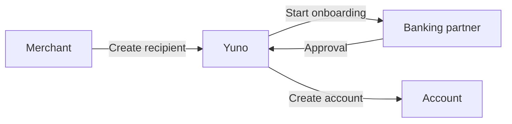
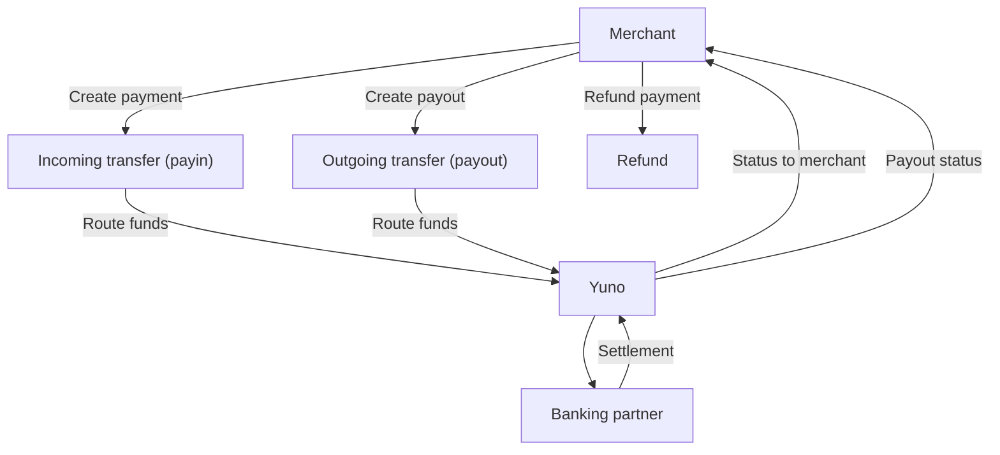

Embedded Banking, or **Banking as a Service (BaaS)**, is a model where licensed banks or virtual banks provide **banking infrastructure to partners**, including **virtual accounts**, **fund custody**, **transfers**, and **payment instruments (cards)**. This enables partners to embed regulated financial services directly into their products without holding a banking license themselves.

It is designed for companies that need to hold or move user balances under a banking license, such as **fintechs**, **exchanges**, **crypto wallets**, and **platforms that manage user funds**.

## Main functionalities

* Register or enroll a user (physical person) with KYC
* Register or enroll an entity (legal person) with KYB
* Create and manage virtual accounts with regulatory limits
* Manage transfers using local and international schemes (ACH, PIX, IBAN, SWIFT, Interac)
* Issue and manage physical or virtual cards under PCI DSS environments

### Other functionalities

* Bill payments
* Cash top-ups (eCash)
* High-yield savings accounts
* P2P transfers between users within the same institution

## Onboard user or entity and create account

Register a user or entity, complete KYC/KYB, and create a virtual account once onboarding is approved.

1. **[Create a recipient](https://docs.y.uno/reference/embedded-banking-create-recipient)** to register the user or entity profile
2. **[Get recipient](https://docs.y.uno/reference/embedded-banking-get-recipient)** to confirm the profile details before onboarding
3. **[Create onboarding](https://docs.y.uno/reference/embedded-banking-create-onboarding)** to initiate KYC/KYB and required validations
4. **[Continue onboarding](https://docs.y.uno/reference/embedded-banking-continue-onboarding-1)** as documents or additional data are requested
5. **[Create bank account](https://docs.y.uno/reference/embedded-banking-create-bank-account)** after approval to open the account
6. **[Retrieve bank account](https://docs.y.uno/reference/embedded-banking-retrieve-bank-account)** to confirm account details

**Optional steps:**

1. **[Update onboarding](https://docs.y.uno/reference/eb-update-onboarding)** if profile data changes during review
2. **[Check onboarding status](https://docs.y.uno/reference/embedded-banking-onboarding-statuses)** to monitor approval progress
3. **[Cancel recipient](https://docs.y.uno/reference/cancel-recipient-1)** if onboarding must be stopped

### Account management

Use bank account endpoints to manage the account lifecycle.

* [Create bank account](https://docs.y.uno/reference/embedded-banking-create-bank-account)
* [Retrieve bank account](https://docs.y.uno/reference/embedded-banking-retrieve-bank-account)

## Incoming and outgoing transfers

Transfers are split into **incoming transfers (payins)** and **outgoing transfers (payouts)**, depending on the direction of funds.

### Incoming transfer (payin)

1. **[Receive payment notifications](https://docs.y.uno/reference/embedded-banking-payment-notifications)** to process payin updates
2. **[Retrieve payment by ID](https://docs.y.uno/reference/retrieve-payment-by-id-1)** to confirm settlement details

### Outgoing transfer (payout)

1. **[Create payout](https://docs.y.uno/reference/create-payout-1)** to send funds to a beneficiary
2. **[Retrieve payout by ID](https://docs.y.uno/reference/retrieve-payout-by-id-1)** to track status and confirm completion

