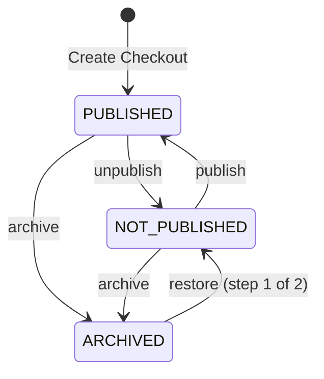

<Note>This API is in **Beta**. Endpoints and schemas may change without prior notice.</Note>

The body carries any combination of `name`, `description`, `status`, and `is_default` — at least one field is required. Metadata (`name`/`description`) is editable in **any** status, including `ARCHIVED`; configuration and styling of an archived checkout stay frozen (the [Publish](/reference/checkout-builder/publish-checkout-configuration) endpoint rejects it).

## Lifecycle state machine

- **Publish** (`status: PUBLISHED`) is only valid from `NOT_PUBLISHED`.
- **Restore is two-step**: an `ARCHIVED` checkout goes back to draft first (`status: NOT_PUBLISHED`), then can be published (`status: PUBLISHED`). A direct `ARCHIVED → PUBLISHED` patch is rejected with `400 INVALID_STATUS_TRANSITION`.
- Patching to the **current** status is also rejected with `400`.
- **Promote** (`is_default: true`) force-publishes the checkout from any state — including `ARCHIVED` — and atomically demotes the previous default. When sent together with `status`, the promotion wins and `status` is ignored. `is_default: false` is rejected with `400`; demote a default by promoting another checkout.
- The **default checkout is guarded**: archiving or unpublishing it is rejected with `409` so the account's storefront is never left without a live checkout.
