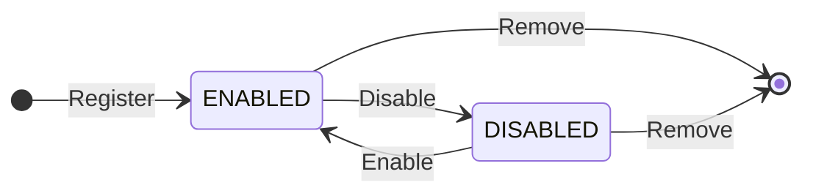

Every host on your PCI Proxy [destination allowlist](/docs/security-and-compliance/pci-proxy/allowlist) has a status that controls whether the [forward proxy](/reference/pci-proxy/invoke-forward-proxy) may send card data to it. A destination is created in the `ENABLED` state and can be toggled without losing its configuration or audit history. Only `ENABLED` destinations are reachable — a request to a `DISABLED` (or removed) host is rejected with `403 DESTINATION_NOT_ALLOWED`.

## Workflow

## Destination status

| Status     | Description                                                                                                   |
| :--------- | :----------------------------------------------------------------------------------------------------------- |
| `ENABLED`  | The destination is active. The forward proxy may send card data to this host. A destination starts here on registration. |
| `DISABLED` | The destination is suspended. Its record and audit history are kept, but the forward proxy will not use it until it is re-enabled. Requests to it return `403 DESTINATION_NOT_ALLOWED`. |
| _(removed)_ | The destination has been deleted from the allowlist. It is no longer returned by List and requests to it are rejected. The deletion remains in the append-only audit log. |
